# Dell S3 Cluster with F5 BIG-IP Local Traffic Manager

This guide describes how to deploy F5 BIG‑IP Local Traffic Manager (LTM) in front of a Dell ObjectScale (OBS) S3 cluster. It covers the network configuration, pool definition, and virtual server setup required to expose the cluster behind a single, highly available S3 endpoint.

The guide is written for network engineers, system administrators, and storage operators who run a Dell OBS cluster and want to use F5 BIG-IP LTM to improve the performance, availability, and scalability of the S3 service. Readers are expected to be familiar with basic L2/L3 networking concepts and to have administrative access to both the BIG-IP and the Dell OBS cluster.

> **Note:** This document is demo content intended to illustrate a reference deployment. Adapt this content for your organization's standards and needs - substitute your own addresses, naming conventions, security policies, and operational practices before applying any of these steps to a production environment.

## Table of Contents

- [Dell S3 Cluster with F5 BIG-IP Local Traffic Manager](#dell-s3-cluster-with-f5-big-ip-local-traffic-manager)
  - [Table of Contents](#table-of-contents)
  - [1. Setup](#1-setup)
    - [1.1 Overview](#11-overview)
    - [1.2 Networking](#12-networking)
    - [1.3 Upgrade rSeries](#13-upgrade-rseries)
    - [1.4 Install BIG-IP Tenant](#14-install-big-ip-tenant)
  - [2. BIG-IP LTM Configuration](#2-big-ip-ltm-configuration)
    - [2.1 Self IPs and Routes](#21-self-ips-and-routes)
      - [2.1.1 Configure Self IPs](#211-configure-self-ips)
      - [2.1.2 Configure Routes](#212-configure-routes)
    - [2.2 Pool](#22-pool)
      - [2.2.1 Pool for S3 traffic from BIG-IP to the Dell OBS cluster](#221-pool-with-unencrypted-traffic-from-big-ip-to-the-dell-obs-cluster)
    - [2.3 Optimization for S3 traffic](#23-optimization-for-s3-traffic)
      - [2.3.1 Nodes Optimization](#231-nodes-optimization)
      - [2.3.2 TCP Profiles](#232-tcp-profiles)
        - [2.3.2.1 Client TCP Profile](#2321-client-tcp-profile)
        - [2.3.2.2 Server TCP Profile](#2322-server-tcp-profile)
      - [2.3.3 SSL Profile](#233-ssl-profile)
        - [2.3.3.1 Client SSL Profile](#2331-client-ssl-profile)
        - [2.3.3.2 Server SSL Profile](#2332-server-ssl-profile)
    - [2.4 Virtual Server](#24-virtual-server)
      - [2.4.1 Virtual Server for S3 client traffic to BIG-IP](#241-http-virtual-server-with-unencrypted-traffic-from-s3-client-to-big-ip)
    - [2.5 Test Virtual Server](#25-test-virtual-server)
      - [2.5.1 Configure Dell Cluster](#251-configure-dell-cluster)
      - [2.5.2 Use WARP to test connectivity to the S3 cluster through the BIG-IP virtual server](#252-use-warp-to-test-connectivity-to-the-s3-cluster-through-the-big-ip-virtual-server)
    - [2.6 Automation with Ansible](#26-automation-with-ansible)

## 1. Setup

### 1.1 Overview

The lab environment used throughout this guide consists of the following components:

- F5 rSeries 12900 appliance
- F5 BIG-IP 21.1.0 deployment
- Dell OBS cluster with 32 nodes
- MinIO WARP CLI tool for load testing

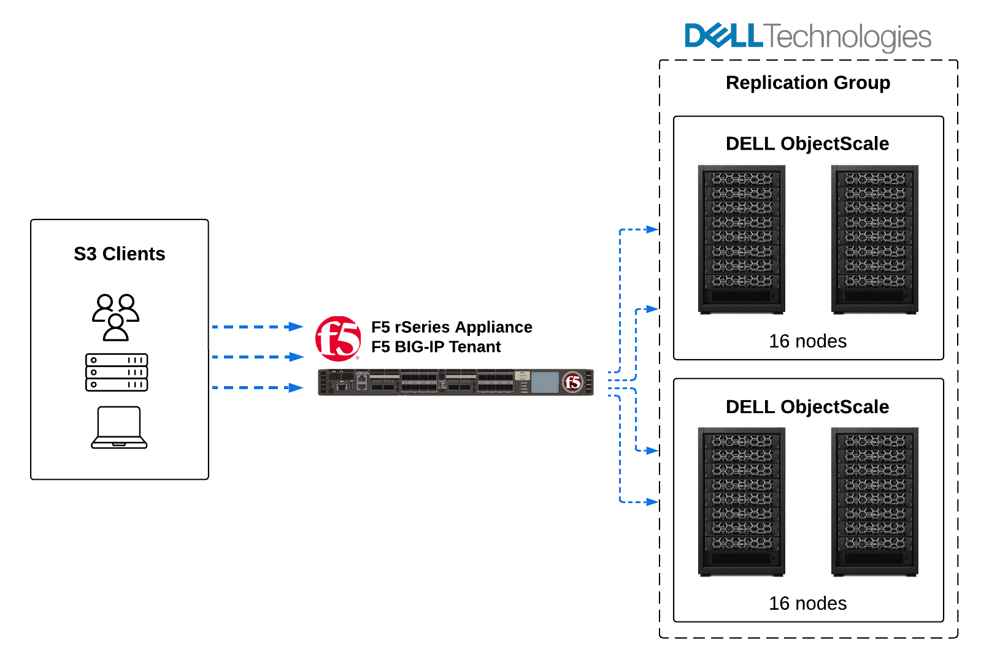

### 1.2 Networking

The tables below list the addresses used in the examples. Substitute your own addresses where appropriate.

| Component                | Interface  | Address                     | VLAN |
| ------------------------ | ---------- | --------------------------- | ---- |
| rSeries appliance (F5OS) | Management | 10.196.24.25                | -    |
| BIG-IP                   | Internal   | 1.1.1.181                   | 1203 |
| BIG-IP                   | External   | 100.1.1.181, 100.1.1.182    | 1202 |
| BIG-IP (Tenant)          | Management | 10.196.24.181               | -    |
| Dell OBS cluster         | OBS nodes  | 172.16.0.161 - 172.16.0.192 | 1203 |

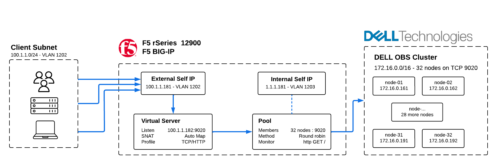

### 1.3 Upgrade rSeries

The rSeries appliance runs F5OS, the platform layer that hosts BIG-IP tenants. The BIG-IP version used in this guide requires a minimum F5OS Appliance Software level, so you upgrade F5OS first to ensure the appliance can run the tenant image deployed in the next section.

Log in to F5 Downloads at [https://my.f5.com/manage/s/downloads](https://my.f5.com/manage/s/downloads) using your MyF5 credentials. If you do not yet have a MyF5 account, create one using the **Sign Up** link on the login page. Select **F5OS** in the **Group** dropdown, then choose **F5OS Appliance Software** in the **Product Line** dropdown. In the **Product Version** dropdown, select 1.8.3 or newer, then select a version.

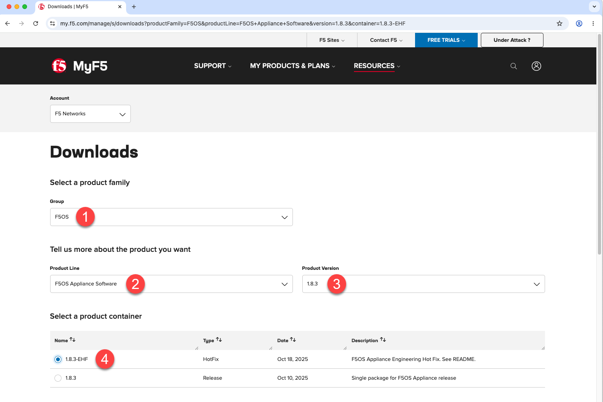

Find the compatible image in the list, select the nearest download location, and click the download.

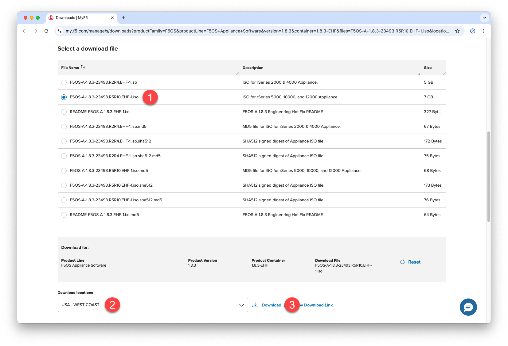

Once the image is downloaded, sign in to the rSeries appliance management interface and navigate to **SYSTEM SETTINGS > Software Management**. Upload the image to the appliance, then in the **Update Software** section select the new image and click **Save** to apply it.

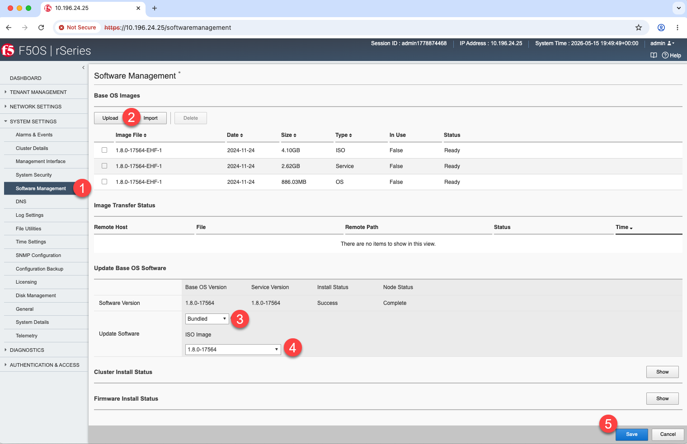

The appliance reboots to apply the new image. After it comes back up, log in again and verify that the new version is active.

### 1.4 Install BIG-IP Tenant

On an rSeries appliance, BIG-IP runs as a tenant: a virtualized BIG-IP instance hosted on the F5OS platform rather than on dedicated hardware. The tenant must be deployed and booted before any BIG-IP configuration can be done, so this section provisions it on the F5OS instance upgraded in the previous step.

Open F5 Downloads at [https://my.f5.com/manage/s/downloads](https://my.f5.com/manage/s/downloads). Select **BIG-IP** in the **Group** dropdown, then choose **BIG-IP v21.x** in the **Product Line** dropdown. In the **Product Version** dropdown, select 21.0.0 or newer, then select the `Tenant_F5OS` product.

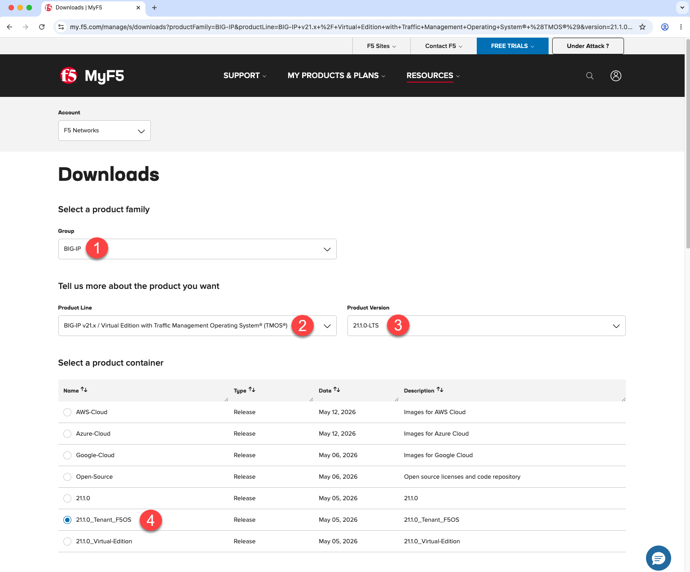

Find the compatible image in the list, select the nearest download location, and click the download.

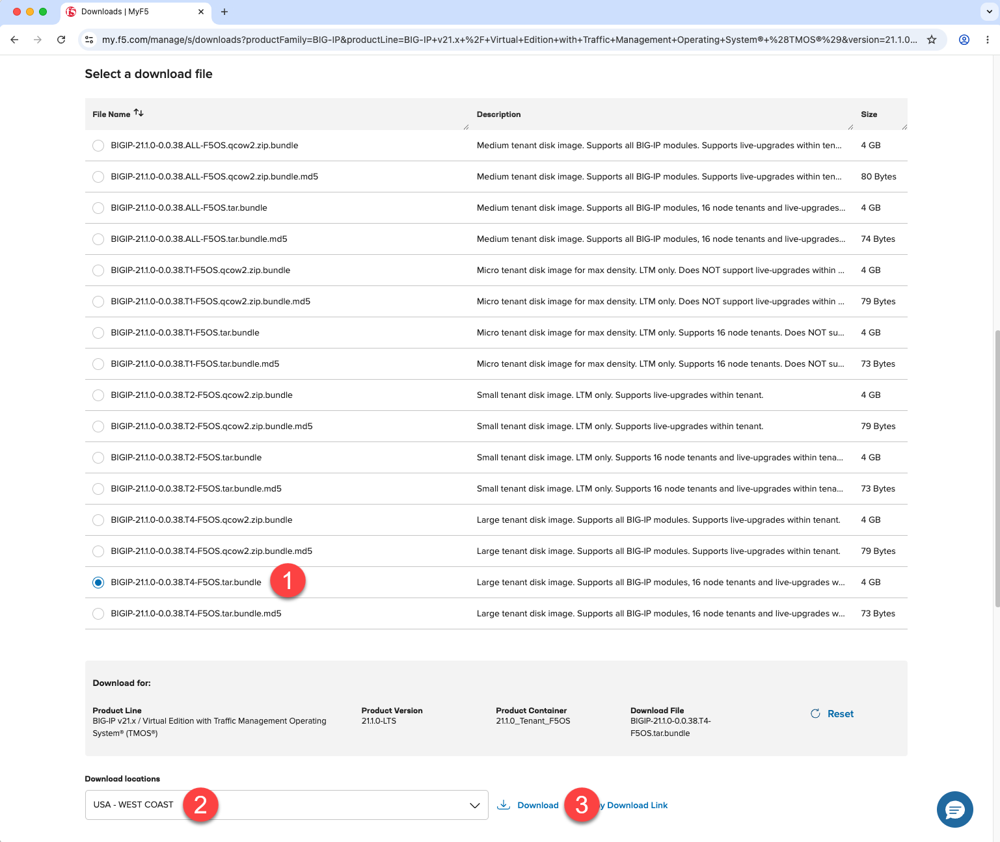

Once the image is downloaded, sign in to the rSeries appliance management interface and navigate to **TENANT MANAGEMENT > Tenant Images**. Upload the BIG-IP tenant image to the appliance.

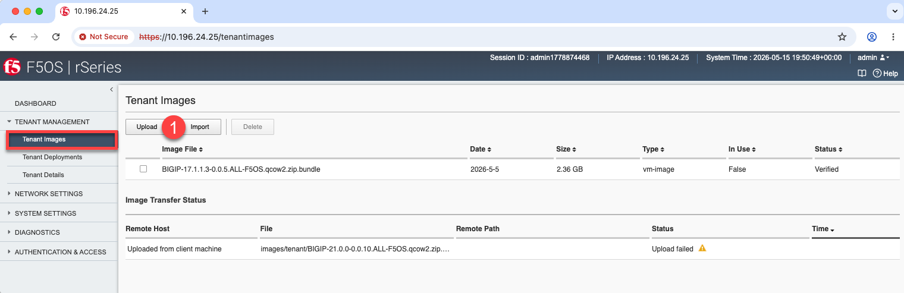

After the image is uploaded, navigate to **TENANT MANAGEMENT > Tenant Deployments** and click **Add**.

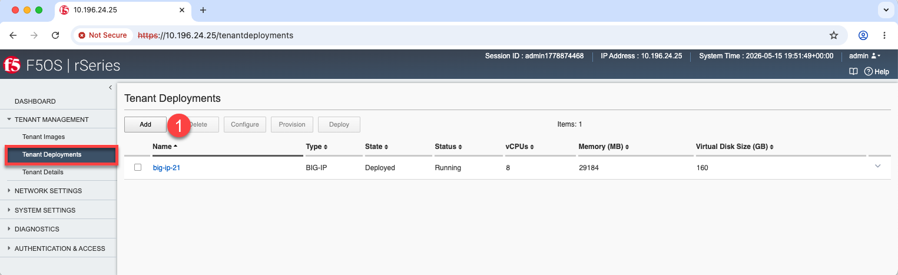

Fill in the form with the following values:

- **Name:** `big-ip`
- **Type:** BIG-IP
- **Image:** select the BIG-IP tenant image you uploaded in the previous step
- **IP Address:** management IP address for the tenant
- **Netmask:** netmask for the management interface
- **Gateway:** default gateway
- **VLANs:** select the internal and external VLANs (1203 and 1202 in this lab)
- **vCPU:** 8
- **Virtual Disk Size:** 180 GB
- **State:** Deployed

Click **Save** to create the tenant deployment. The appliance provisions the tenant and boots it up, which takes a few minutes. Once the tenant is up, access the BIG-IP GUI at the management IP address you assigned to it. Log in with the default credentials (admin / admin) and change the password when prompted.

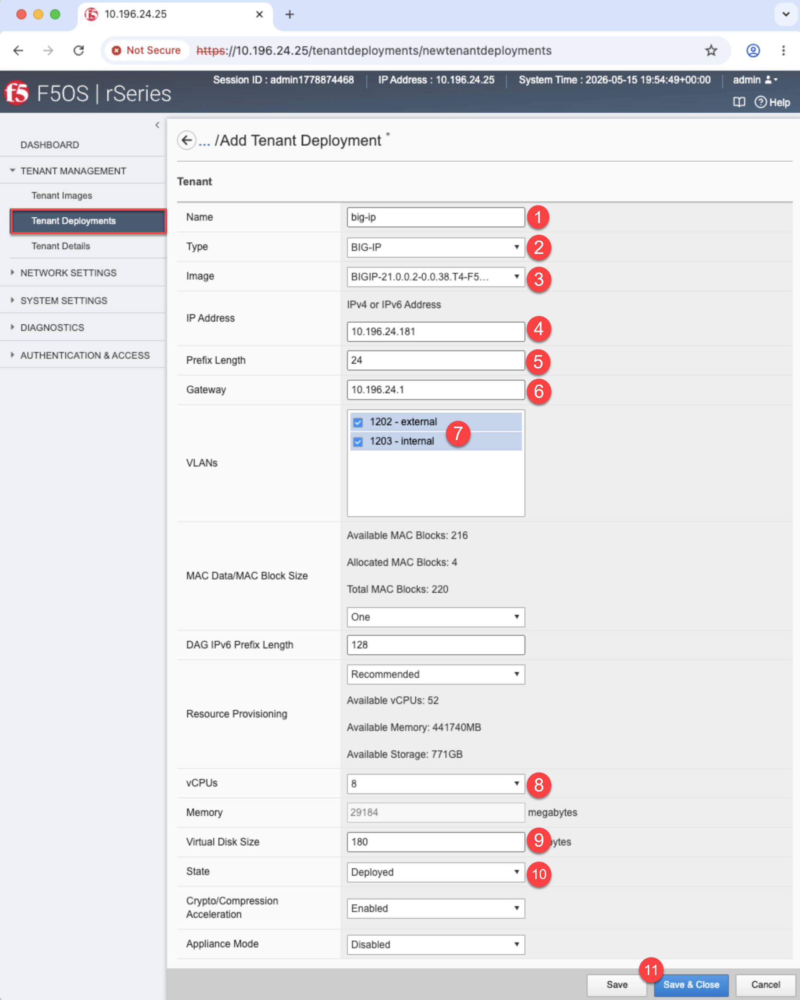

## 2. BIG-IP LTM Configuration

### 2.1 Self IPs and Routes

A Self IP is an address on the BIG-IP that belongs to a specific VLAN and is used by the BIG-IP itself to source traffic and respond to ARP requests. Every VLAN that participates in client or server traffic needs at least one Self IP. Because this lab has two participating VLANs, internal (facing the Dell OBS cluster) and external (facing S3 clients), you configure two Self IPs, one per VLAN.

#### 2.1.1 Configure Self IPs

Begin by adding the Self IPs that anchor the BIG-IP to each VLAN. In the BIG-IP Configuration utility, go to **Network > Self IPs** and click **Create**.

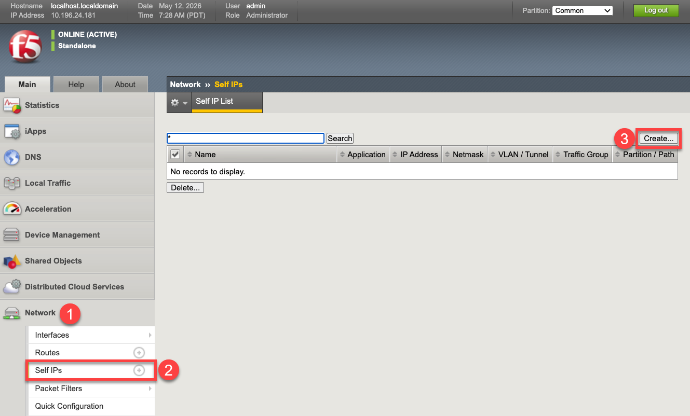

First, create a Self IP for the internal network using the following values:

- **Name:** `internal`
- **IP Address:** 1.1.1.181
- **Netmask:** 255.255.255.0
- **VLAN:** internal (VLAN 1203 in this lab)

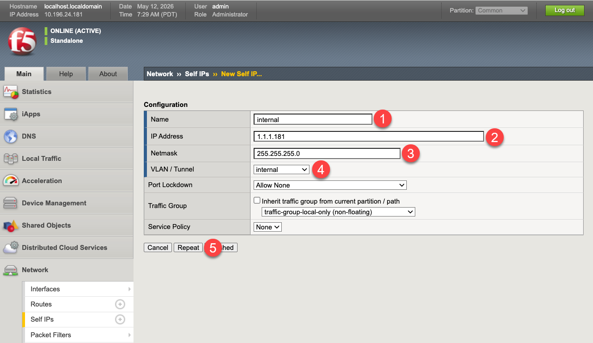

Click **Repeat** to save the internal Self IP and open a fresh form for the external one, then fill in the following values:

- **Name:** `external`
- **IP Address:** 100.1.1.181
- **Netmask:** 255.255.255.0
- **VLAN:** external (VLAN 1202 in this lab)

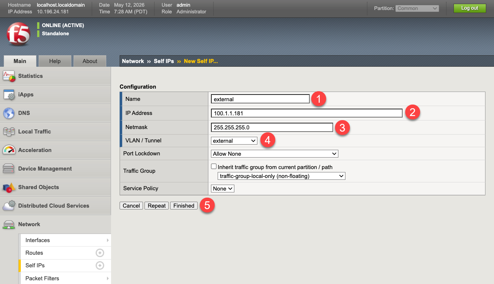

Click **Finished** to save. Both Self IPs now appear in the list.

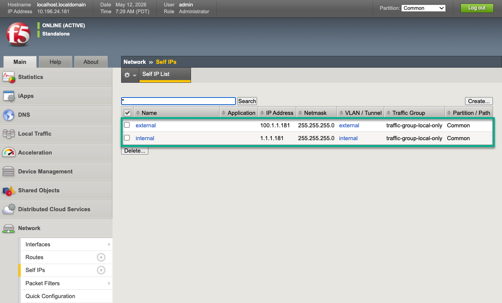

#### 2.1.2 Configure Routes

With the Self IPs in place, the BIG-IP can communicate inside each connected VLAN. The Dell OBS cluster nodes (172.16.0.0/16), however, live in a different subnet than the internal Self IP (1.1.1.0/24), so the BIG-IP needs an explicit route through the upstream gateway to reach them. The gateway used here (1.1.1.254) must be reachable on the internal VLAN and must itself have a path to 172.16.0.0/16. Without this route, health monitors and pool traffic fail.

Navigate to **Network > Routes** and click **Create**.

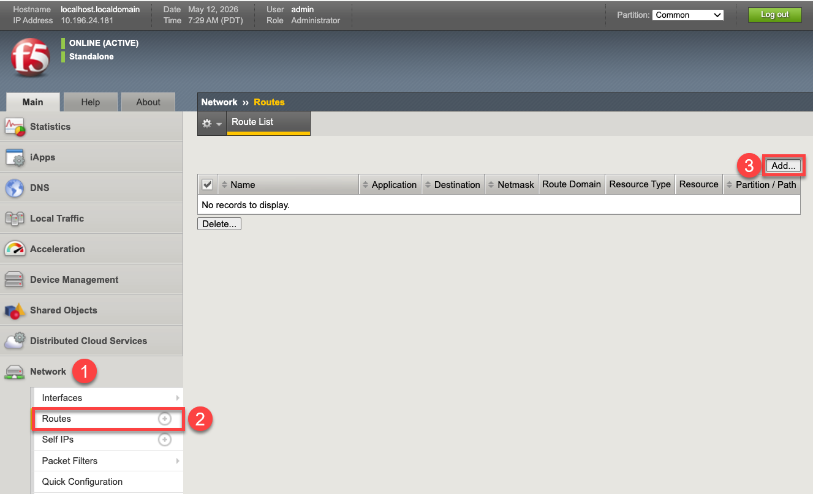

Fill in the following values:

- **Name:** `dell-cluster`
- **Destination:** 172.16.0.0
- **Netmask:** 255.255.0.0
- **Resource:** Use Gateway...
- **Gateway IP Address:** 1.1.1.254

Click **Finished** to save the route.

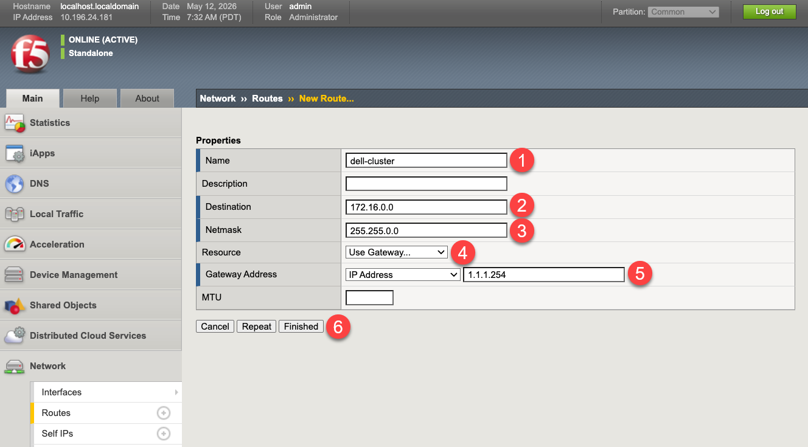

The new route now appears in the Routes list.

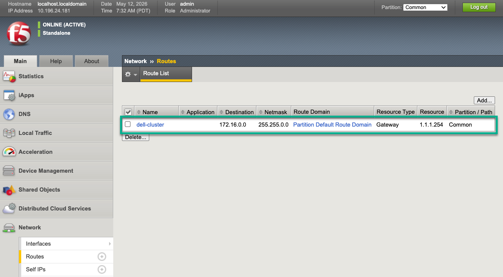

### 2.2 Pool

A pool is a logical group of backend servers, called pool members, that the BIG-IP load balances traffic across. The BIG-IP runs a health monitor against each member and only forwards traffic to members that pass the monitor. In this guide the pool members are the Dell OBS nodes, and the BIG-IP distributes incoming S3 requests across them.


In the picture above, the blue lines on either side of the BIG-IP represent the two segments of S3 traffic. The lines on the left are the traffic between the S3 client(s) and the BIG-IP, and the lines on the right are the traffic between the BIG-IP and the 32-node Dell OBS cluster. Each segment can be unencrypted or encrypted, and you can decide this for each one separately. Some organizations require storage traffic to be encrypted all the way from the S3 client to the S3 storage node, and some do not.

The **pool** configuration in this section controls the right-hand segment, the traffic between the BIG-IP and the OBS nodes. The left-hand segment, between the S3 client and the BIG-IP, is controlled by the **virtual server** (see [2.4 Virtual Server](#24-virtual-server)). This guide provides steps for both unencrypted and encrypted options on each segment, so you can choose the combination that meets your organization's requirements.

#### 2.2.1 Pool for S3 traffic from BIG-IP to the Dell OBS cluster

Now that the BIG-IP has reachability to the Dell OBS cluster subnet, define the pool that represents the cluster. Navigate to **Local Traffic > Pools** and click **Create**.

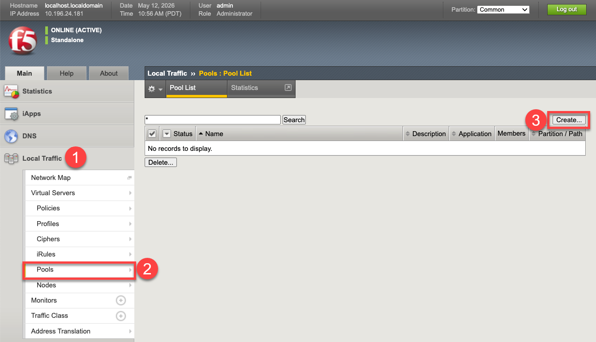

Fill in the pool-level details:

- **Name:** `dell-cluster`
- **Health Monitor:** https
- **Load Balancing Method:** Least Connections

The built-in `https` monitor assumes the Dell OBS nodes serve S3 traffic over TLS and checks the health of each node by making an HTTPS request to it. If your OBS cluster serves unencrypted S3 traffic, change the monitor to `http` instead.

In the **New Members** section, add the first Dell OBS node:

- **Name:** `node-01`
- **Address:** 172.16.0.161
- **Service Port:** use `9021` for encrypted S3 traffic or `9020` for unencrypted traffic

Click **Add** to save it to the member list, then enter the next node's details and click **Add** again. All 32 nodes from the cluster range (172.16.0.161 - 172.16.0.192) must be added before the pool is complete. Once every node appears in the member list, click **Finished**.

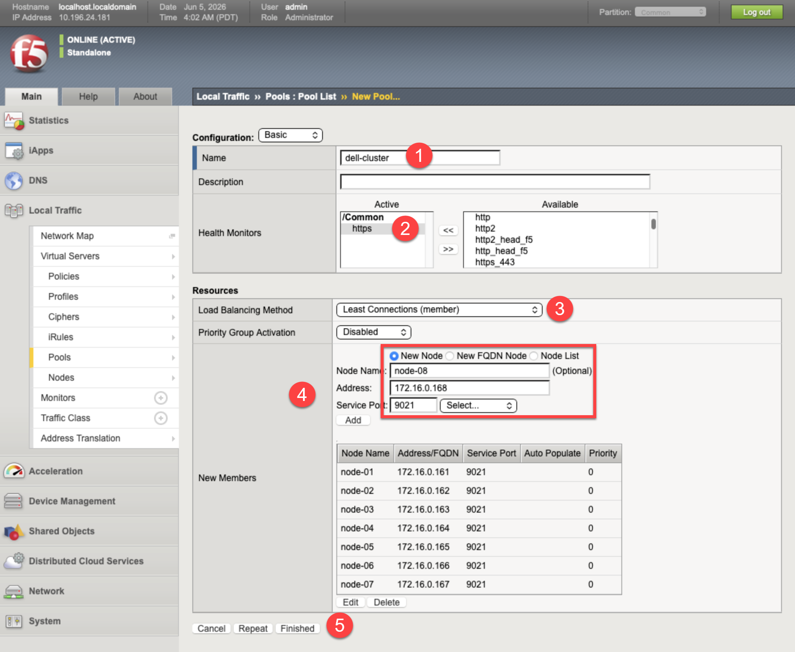

The new pool now appears in the Pools list.

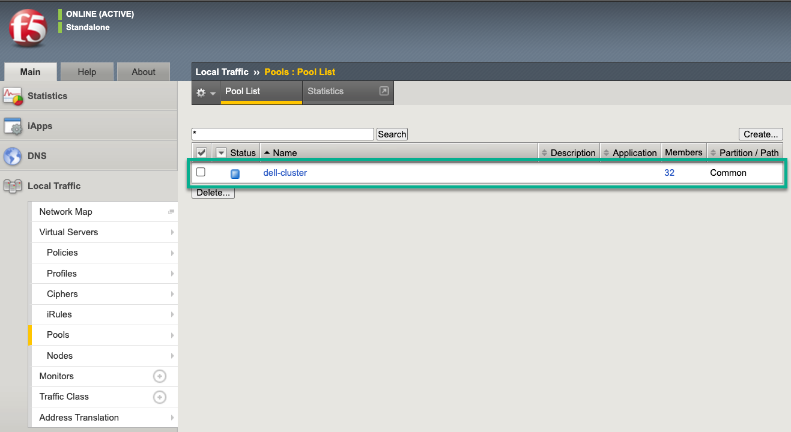

### 2.3 Optimization for S3 traffic

Tuning the BIG-IP configuration for the specific characteristics of S3 traffic can improve performance and efficiency. This section outlines some of the key optimizations to consider for an S3 workload, including connection limits and TCP profile settings. These optimizations are optional but can help you get the most out of your BIG-IP deployment in front of a Dell OBS cluster.

#### 2.3.1 Nodes Optimization

For Dell ObjectScale (OBS), each storage node supports a maximum of 1,000 S3 connections. To prevent overwhelming the nodes, we configure a connection limit on members of the pool that represent the OBS nodes. This ensures that the BIG-IP stops sending traffic to a node once it reaches its maximum connection capacity, which helps maintain performance and stability.

Navigate to **Local Traffic > Nodes > Node List** and select the first node in the pool.

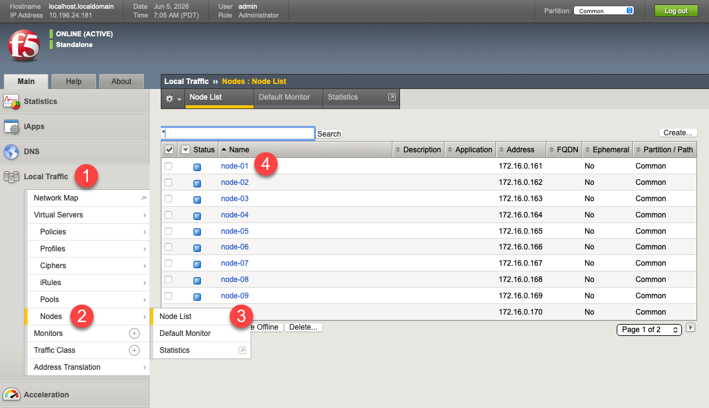

In the node details, scroll down to the **Connection Limit** setting and enter `1000`. This limits the number of concurrent connections that the BIG-IP can have open to this node. Click **Update** to save the change, then repeat this process for each of the 32 nodes in the pool.

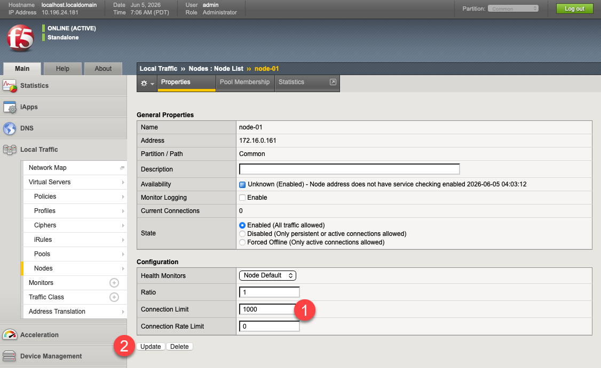

#### 2.3.2 TCP Profiles

A TCP profile controls how the BIG-IP manages TCP connections, such as timers, buffer sizes, and congestion control. The BIG-IP ships with built-in profiles, but the default values are not ideal for Dell S3 traffic. For better performance, F5 engineers recommend creating two custom profiles: one for the client side (between the S3 client and the BIG-IP) and one for the server side (between the BIG-IP and the Dell OBS nodes). Each side has different needs, so the settings are tuned separately.

The following sections walk through both profiles. Start by navigating to **Local Traffic > Profiles > Protocol > TCP** and clicking **Create**.

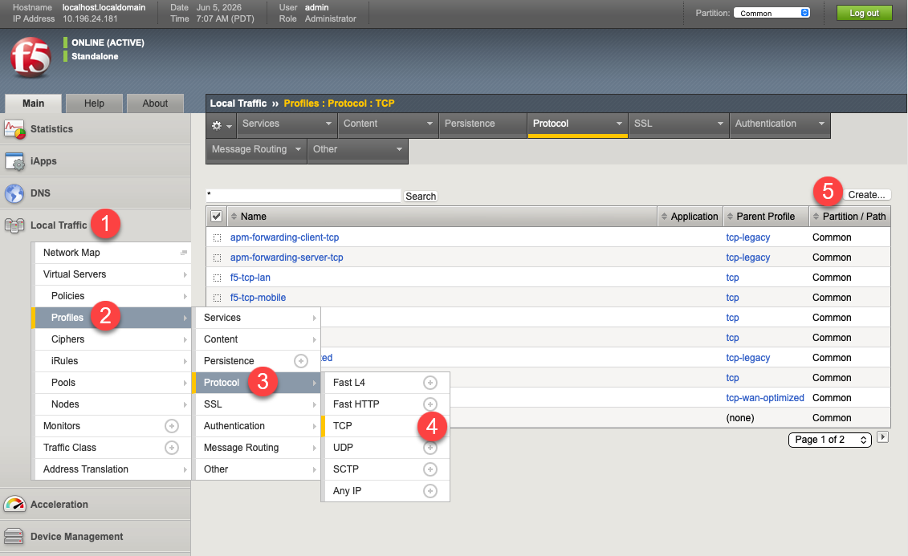

##### 2.3.2.1 Client TCP Profile

Set the name to `s3-tcp-custom-client` and set the parent profile as `s3-tcp`. This creates a new TCP profile that inherits all the settings from the `s3-tcp` profile, which is optimized for S3 workloads, and allows you to customize it.

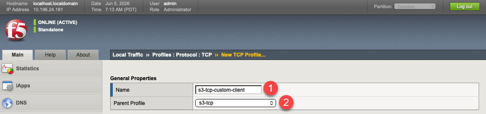

In the **Timer Manager** section, set the **Minimum RTO** to `200` milliseconds. This reduces the minimum retransmission timeout, which can improve performance for S3 workloads that are sensitive to latency.


In the **Data Transfer** section, set the **Nagle's Algorithm** to **Auto**. This allows the BIG-IP to decide when to enable or disable Nagle's algorithm based on the traffic patterns, which can help optimize throughput for S3 workloads.


In the **Congestion Control** section, set the **Congestion Control** to **CUBIC**. CUBIC is a modern congestion control algorithm that can improve performance in high-bandwidth, high-latency networks, which can be beneficial for S3 traffic.

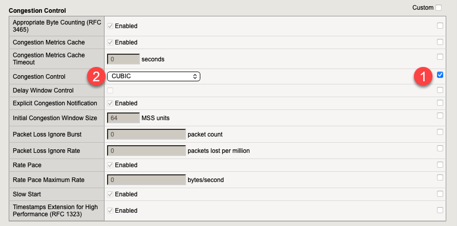

Click **Finished** to save the client TCP profile.

##### 2.3.2.2 Server TCP Profile

Create another TCP profile for the server side with the name `s3-tcp-custom-server` and the parent profile as `f5-tcp-lan`.

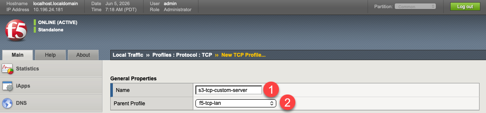

In the **Memory Management** section, set the following values:

- **Auto Receive Window** to **Enabled**
- **Auto Send Buffer** to **Enabled**
- **Proxy Buffer High** to `5200000` bytes
- **Proxy Buffer Low** to `5100000` bytes

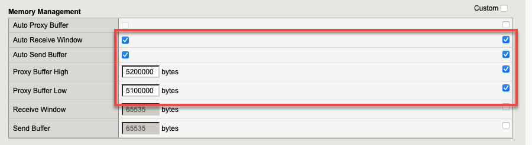

In the **Loss Detection and Recovery** section, set the **Tail Loss** to **Disabled**.

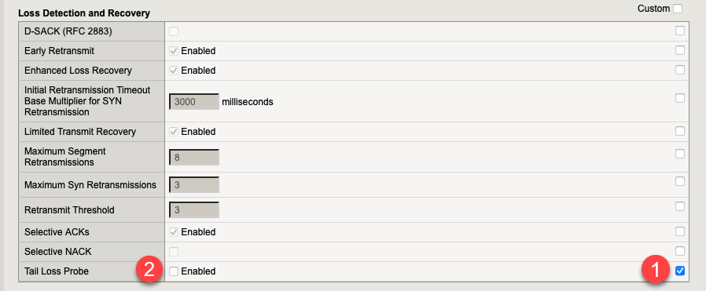

Click **Finished** to save the server TCP profile.

#### 2.3.3 SSL Profile

In this section we create SSL profiles for the client and server sides. The client SSL profile configures how the BIG-IP terminates TLS connections from S3 clients, while the server SSL profile configures how the BIG-IP initiates TLS connections to the Dell OBS nodes if your cluster serves encrypted S3 traffic. If your cluster serves unencrypted traffic, you can skip the server SSL profile and set the pool members' service port to 9020 instead of 9021.

> **Note:** The following SSL profile configurations assume that the Dell OBS nodes use self-signed certificates or certificates that are not trusted by the BIG-IP. Don't use these settings in a production environment without understanding the security implications. In a production environment, you should use certificates from a trusted CA and configure the server SSL profile to validate them properly.

##### 2.3.3.1 Client SSL Profile

Go to **Local Traffic > Profiles > SSL > Client** and click **Create**.

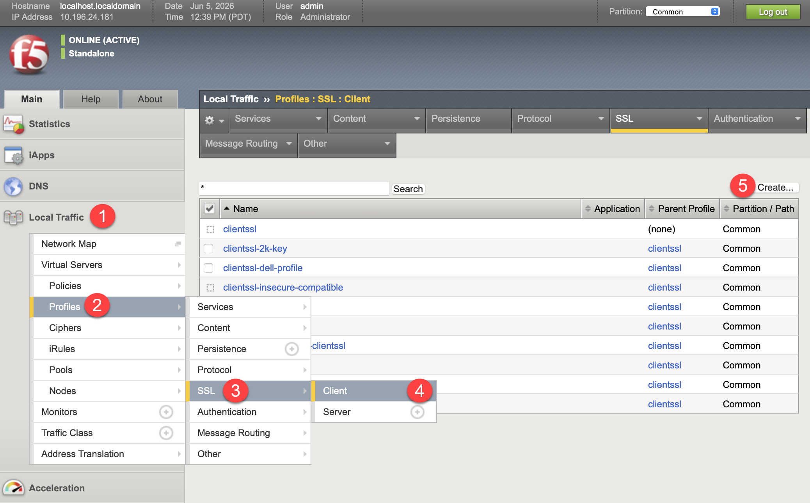

Set the name to `clientssl-dell-profile` and the parent profile to `clientssl`. In the **Configuration** section, set the **Certificate Key Chain** to the certificate and private key that the BIG-IP will use to terminate TLS connections from S3 clients. This should be a certificate that is trusted by your S3 clients, which may require using a certificate from a public CA or adding your own CA to the clients' trust stores if you use a self-signed certificate.

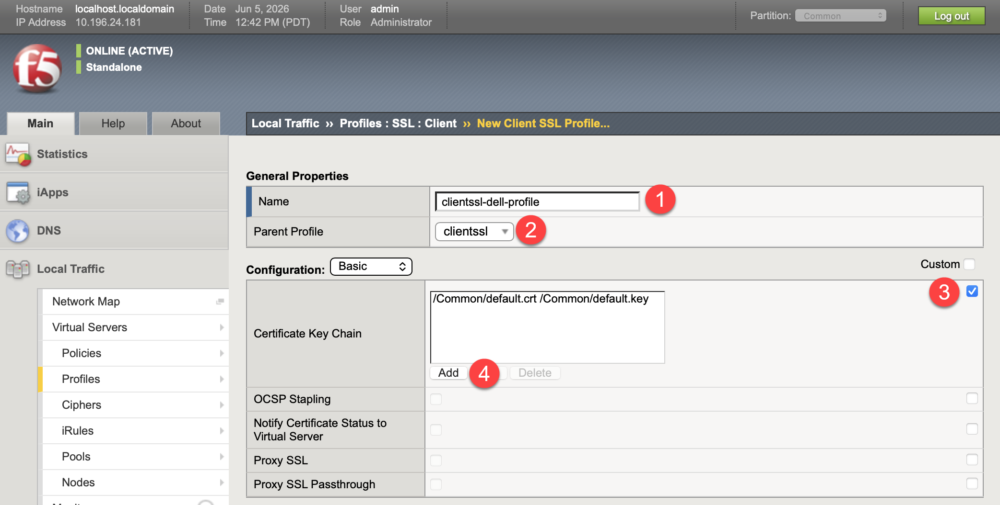

##### 2.3.3.2 Server SSL Profile

Go to **Local Traffic > Profiles > SSL > Server** and click **Create**.

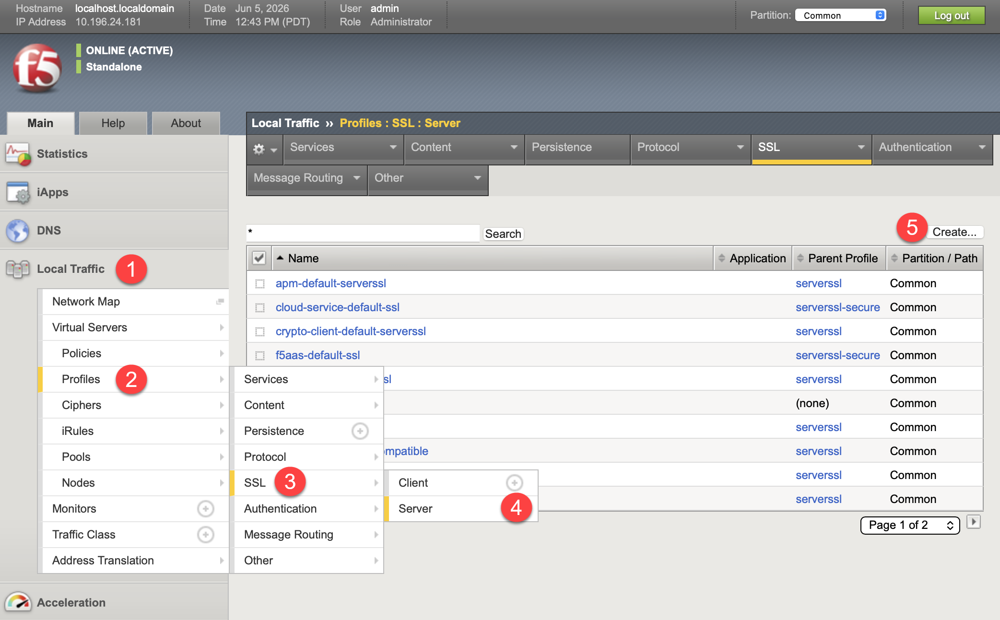

Set the name to `serverssl-dell-profile` and the parent profile to `serverssl`. In the **Server Authentication** section, set the **Server Certificate** to **Ignore**. This tells the BIG-IP not to validate the certificate presented by the Dell OBS nodes, which is necessary if the nodes use self-signed certificates or certificates that are not trusted by the BIG-IP.

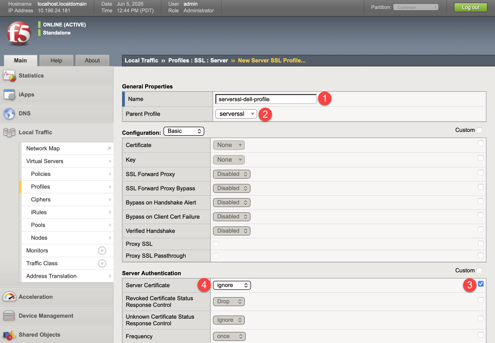

### 2.4 Virtual Server

A virtual server is the listener that clients connect to. It binds an IP address and port on the BIG-IP to a pool, applies any configured profiles and policies, and forwards traffic to a healthy pool member according to the load balancing method. For this S3 deployment, the virtual server is the single endpoint that S3 clients target instead of talking to individual Dell nodes.

As shown in the setup diagram in the [Pool section](#22-pool), the virtual server controls the left-hand segment of traffic, between the S3 client(s) and the BIG-IP. Like the pool, the virtual server can be configured for unencrypted (HTTP) or encrypted (HTTPS) traffic, and this guide provides the steps for both. The two segments are independent: you can, for example, terminate TLS from clients at the BIG-IP while sending either encrypted or unencrypted traffic onward to the OBS cluster.

#### 2.4.1 Virtual Server for S3 client traffic to BIG-IP

With the pool in place, create the virtual server that exposes it. Navigate to **Local Traffic > Virtual Servers** and click **Create**.

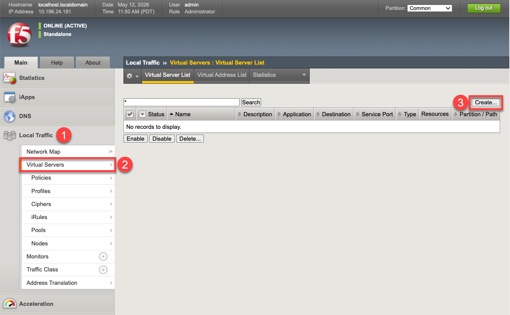

Fill in the basic details:

- **Name:** `dell-cluster-vs`
- **Source Address:** `0.0.0.0/0`
- **Destination Address/Mask:** 100.1.1.182 - Virtual IP (VIP) that S3 clients connect to
- **Service Port:** 443 (or 80 for unencrypted traffic)

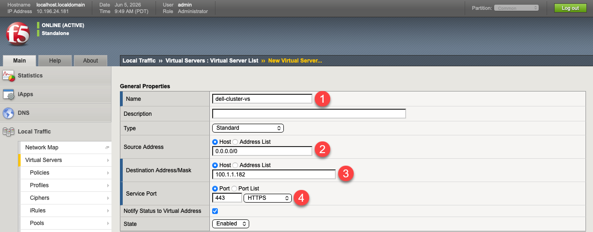 123213

Next configure the Virtual Server Details:

- **1. Protocol**: Set to **TCP**
- **2. Protocol Profile (Client)**: Set to the custom client TCP profile you created earlier (`s3-tcp-custom-client`)
- **3. Protocol Profile (Server)**: Set to the custom server TCP profile you created earlier (`s3-tcp-custom-server`)
- **4. HTTP Client Profile**: Set to **HTTP**
- **5. SSL Profile (Client)**: Set to the client SSL profile you created earlier (`clientssl-dell-profile`). Skip this if you want to use unencrypted HTTP between S3 clients and the BIG-IP.
- **6. SSL Profile (Server)**: Set to the server SSL profile you created earlier (`serverssl-dell-profile`) if your Dell OBS cluster serves encrypted S3 traffic. If your cluster serves unencrypted traffic, set this to **None** and make sure the pool members' service port is set to 9020.
- **7. Source Address Translation:** Set to **Auto Map** to allow the BIG-IP to manage source address translation for return traffic.

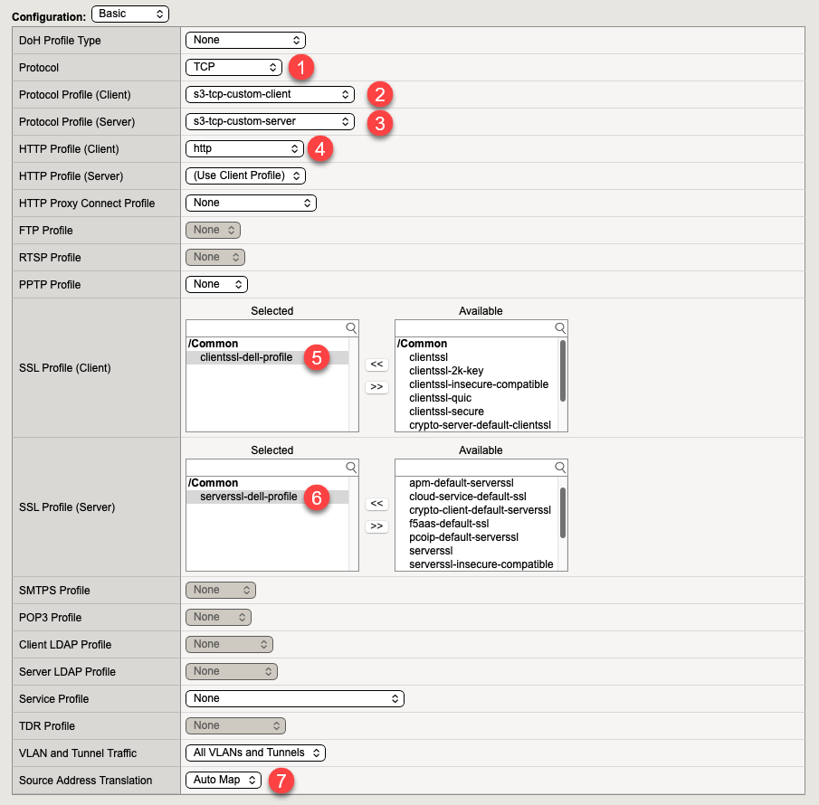

In the **Resources** section, select the `dell-cluster` pool from the **Default Pool** dropdown to bind the virtual server to the backend nodes.

Click **Finished** to save the virtual server.

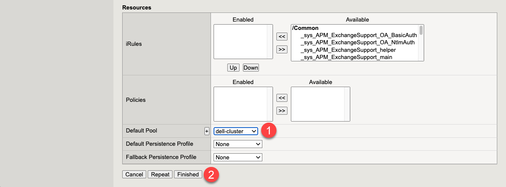

The virtual server now appears in the list. A green circle next to its name indicates that the virtual server is up and at least one pool member is passing health checks.

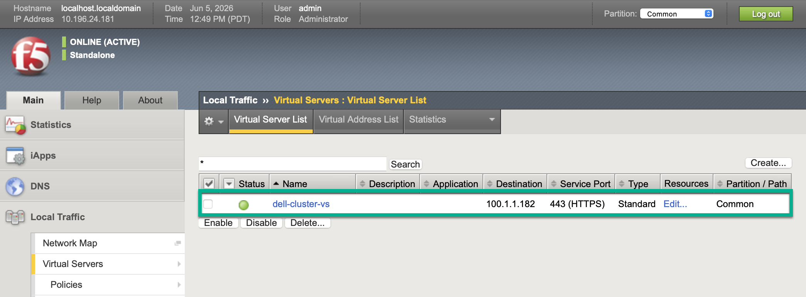

### 2.5 Test Virtual Server

With the virtual server up and at least one healthy pool member, validate that S3 traffic flows end to end through the BIG-IP.

#### 2.5.1 Configure Dell Cluster

Before any traffic can be tested, the Dell OBS cluster needs an S3 namespace, an object user, and a secret key.

Log in to the Dell OBS management console. Navigate to **Namespaces** and click **Create Namespace**.

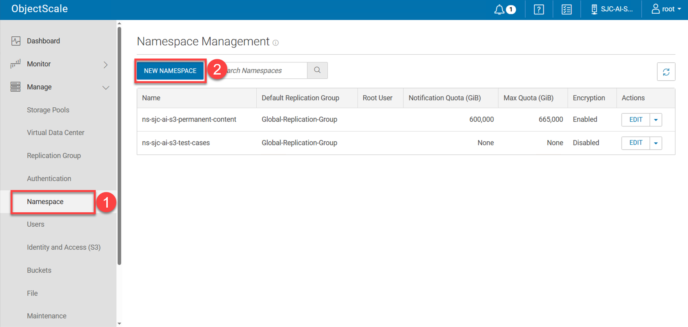

Fill in the following values:

- **Name:** `big-ip-demo`
- **Namespace Admin:** `root@@big-ip-demo`
- **Replication Group:** `Global-Replication-Group`

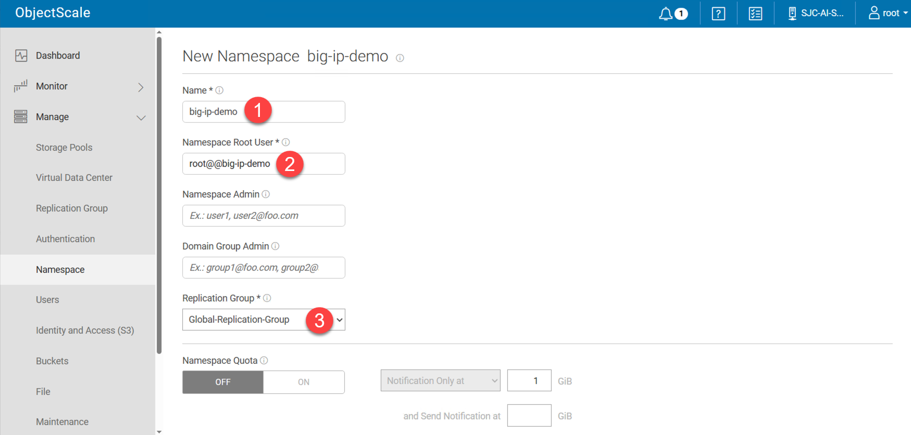

Click **Save** to create the namespace.

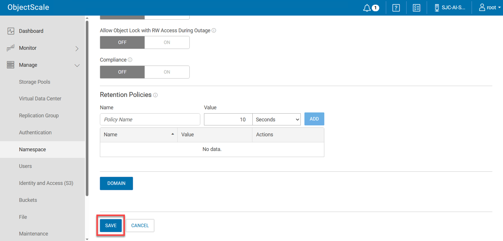

Next, create the object user that will own the test workload. Navigate to **Users** and click **New Object User**.

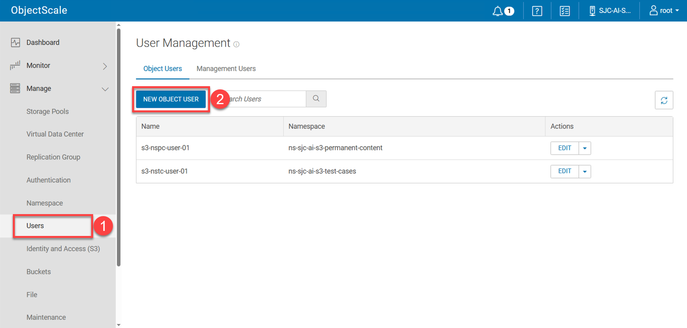

Fill in the following values:

- **Username:** `bigip-demo-user`
- **Namespace:** `big-ip-demo` (the namespace created in the previous step)

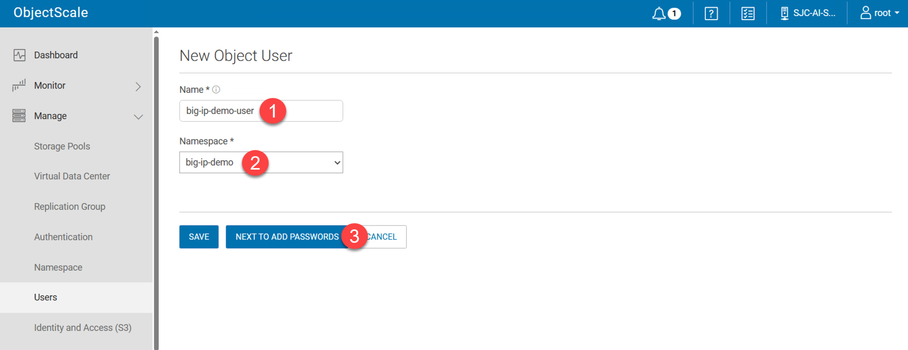

On the user detail page, click **Generate & Add Secret Key** to create an access key and secret key for the user.

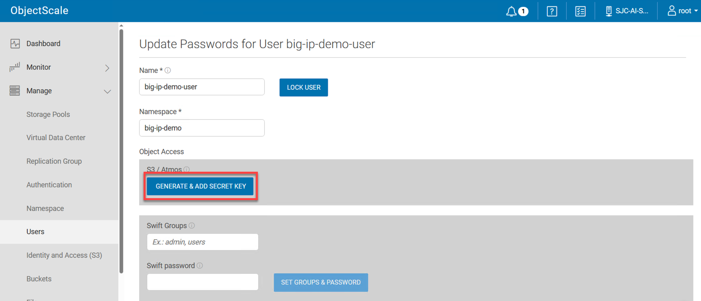

In the confirmation dialog, click **Generate** to issue the new key.

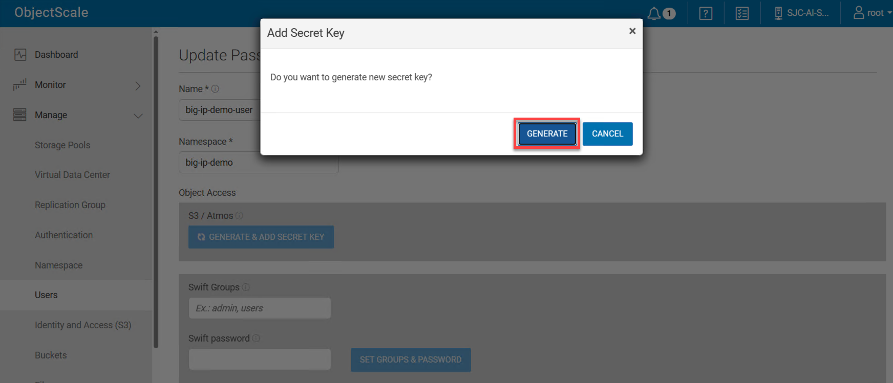

The cluster returns the access key and secret key. Copy them to a secure location now. The secret key is only shown once. These values will be used by the test client to authenticate to the S3 cluster through the BIG-IP virtual server.

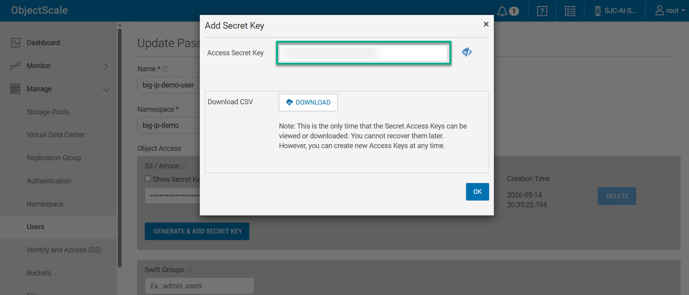

#### 2.5.2 Use WARP to test connectivity to the S3 cluster through the BIG-IP virtual server

WARP is MinIO's S3 benchmarking tool. It drives a representative S3 workload (mixed PUT, GET, DELETE, and STAT operations) against an endpoint and reports throughput, latency, and error counts. Pointing WARP at the BIG-IP virtual server address, rather than at an individual Dell OBS node, confirms that traffic flows end to end through the load balancer and gives a baseline measurement of the cluster's performance behind the BIG-IP.

Download and install the MinIO WARP CLI from the official MinIO download page:

[https://www.min.io/download/minio-warp](https://www.min.io/download/minio-warp)

Configure WARP with the BIG-IP virtual server address as the S3 endpoint, along with the access key (username) and secret key generated on the Dell OBS cluster, and run a short mixed-workload test:

```bash
export WARP_HOST=100.1.1.182:443        # the BIG-IP virtual server address and port
export WARP_ACCESS_KEY=your-user-name   # the user name you created on the Dell OBS cluster
export WARP_SECRET_KEY=your-secret-key  # the secret key you generated for the user on the Dell OBS cluster

# add --tls --insecure if the BIG-IP virtual server uses a self-signed certificate for TLS
warp mixed \
  --tls --insecure \
  --host "$WARP_HOST" \
  --access-key "$WARP_ACCESS_KEY" \
  --secret-key "$WARP_SECRET_KEY" \
  --bucket warp-connectivity-test \
  --objects 10 \
  --obj.size 1KiB \
  --concurrent 1 \
  --duration 2s \
  --json > test_result.json
```

When the run finishes, use `jq` to summarize the totals from the JSON report. Inspect the full output with `cat test_result.json` if you need a detailed breakdown.

```bash
jq -r '
  .total |
  "Requests: \(.total_requests) | Objects: \(.total_objects) | Bytes: \(.total_bytes) | Errors: \(.total_errors)"
' test_result.json


Requests: 26 | Objects: 26 | Bytes: 17408 | Errors: 0
```

A zero error count confirms that every request reached the cluster and returned a successful response through the virtual server. To verify the workload from the cluster's perspective, return to the Dell OBS management console and open the **Buckets** section. The `warp-connectivity-test` bucket created by WARP should be listed.

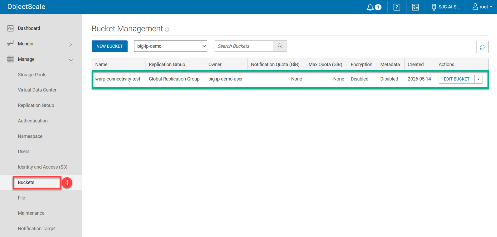

### 2.6 Automation with Ansible

The manual steps above can be reproduced declaratively with Ansible. The playbooks, roles, and inventory live in [automation/](./automation/). See [automation/README.md](./automation/README.md) for installation, credentials, and usage.
