# MinIO AIStor Cluster with F5 BIG-IP Local Traffic Manager

This guide describes how to deploy F5 BIG‑IP Local Traffic Manager (LTM) in front of a MinIO AIStor S3 cluster. It covers the network configuration, custom write quorum monitor creation, pool definition, and virtual server setup required to expose the cluster behind a single, highly available S3 endpoint.

The guide is written for network engineers, system administrators, and storage operators who run a MinIO AIStor cluster and want to use F5 BIG-IP LTM to improve the performance, availability, and scalability of the S3 service. Readers are expected to be familiar with basic L2/L3 networking concepts and to have administrative access to both the BIG-IP and the MinIO AIStor cluster.

> **Note:** This document is demo content intended to illustrate a reference deployment. Adapt this content to your organization's standards and needs: substitute your own addresses, naming conventions, security policies, and operational practices before applying any of these steps to a production environment.

## Table of Contents

- [1. Setup](#1-setup)
  - [1.1 Overview](#11-overview)
  - [1.2 Networking](#12-networking)
- [2. BIG-IP Configuration](#2-big-ip-configuration)
  - [2.1 VLAN Configuration](#21-vlan-configuration)
  - [2.2 Configure Self IPs](#22-configure-self-ips)
  - [2.3 HTTP/HTTPS Custom Write Quorum Monitor](#23-httphttps-custom-write-quorum-monitor)
  - [2.4 Pool](#24-pool)
    - [2.4.1 Pool for S3 traffic from BIG-IP to the MinIO AIStor cluster](#241-pool-for-s3-traffic-from-big-ip-to-the-minio-aistor-cluster)
  - [2.5 Optimization for S3 Traffic](#25-optimization-for-s3-traffic)
    - [2.5.1 TCP Profiles](#251-tcp-profiles)
      - [2.5.1.1 Client TCP Profile](#2511-client-tcp-profile)
      - [2.5.1.2 Server TCP Profile](#2512-server-tcp-profile)
    - [2.5.2 SSL Profiles](#252-ssl-profiles)
      - [2.5.2.1 Client SSL Profile](#2521-client-ssl-profile)
      - [2.5.2.2 Server SSL Profile](#2522-server-ssl-profile)
  - [2.6 Virtual Server](#26-virtual-server)
    - [2.6.1 Virtual Server for S3 Client Traffic to BIG-IP](#261-virtual-server-for-s3-client-traffic-to-big-ip)
  - [2.7 Test Virtual Server](#27-test-virtual-server)
    - [2.7.1 Configure MinIO AIStor Cluster](#271-configure-minio-aistor-cluster)
      - [2.7.1.1 Create Bucket](#2711-create-bucket)
      - [2.7.1.2 Set Up User](#2712-set-up-user)
    - [2.7.2 Use MinIO Warp to Test Connectivity to the MinIO AIStor S3 Cluster Through the BIG-IP Virtual Server](#272-use-minio-warp-to-test-connectivity-to-the-minio-aistor-s3-cluster-through-the-big-ip-virtual-server)
  - [2.8 Automation with Ansible](#28-automation-with-ansible)

## 1. Setup

### 1.1 Overview

The lab environment used throughout this guide consists of the following components:

- F5 BIG-IP 21.1.0
- MinIO AIStor cluster with two pools and two nodes each
- MinIO Warp CLI tool for load testing

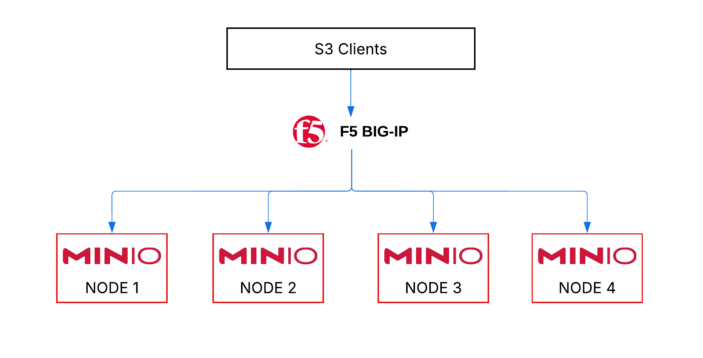

### 1.2 Networking

The table below lists the addresses used in the examples. Substitute your own addresses where appropriate.

| Component | VLAN     | Address     | Interface      |
| --------- | -------- | ----------- | -------------- |
| BIG-IP    | Internal | 10.1.10.151 | 1.1 (untagged) |
| BIG-IP    | External | 10.1.40.151 | 1.2 (untagged) |

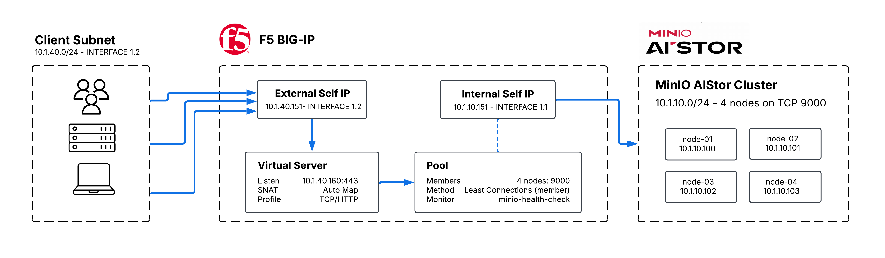

## 2. BIG-IP Configuration

### 2.1 VLAN Configuration

Begin by adding VLANs to the BIG-IP. In the BIG-IP Configuration utility, go to **Network > VLANs** and click **Create**.
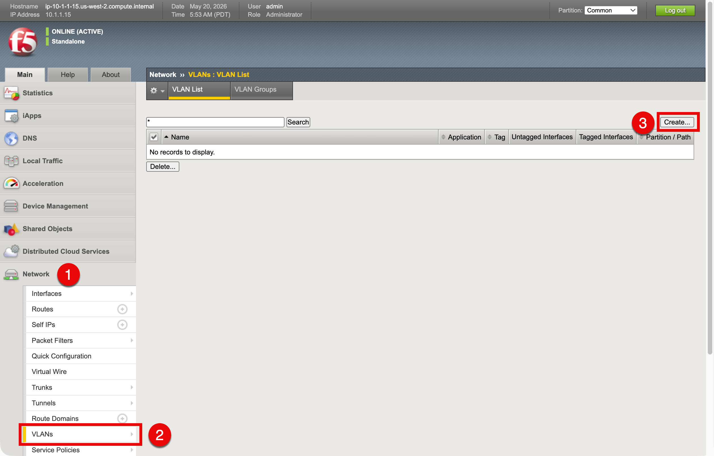

Create the **internal** VLAN:
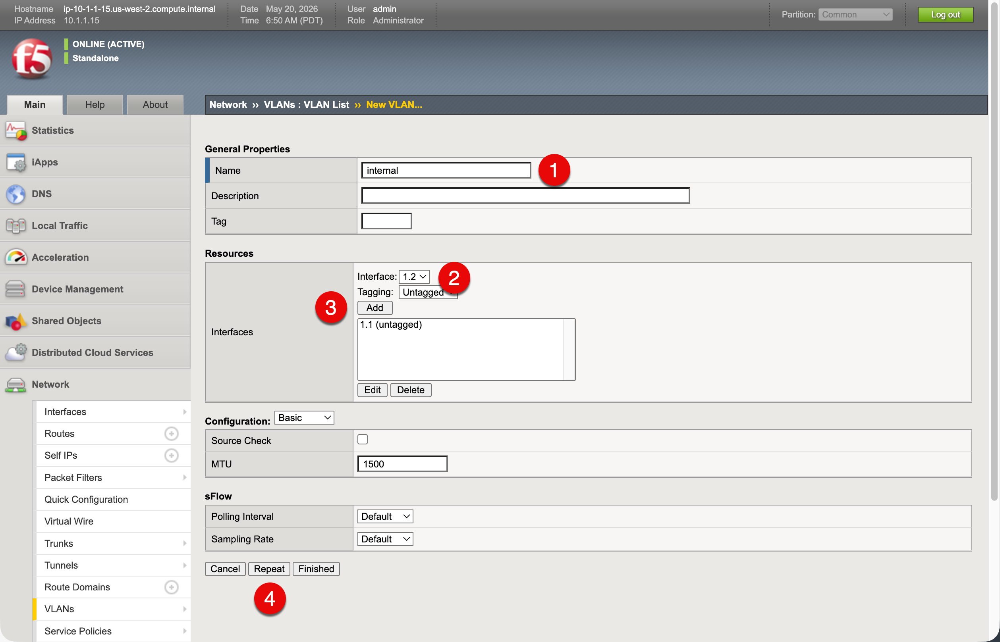

- **Name:** `internal`
- **Interface:** `1.1`
- **Tagging:** `Untagged`
- Click **Add**
- Click **Repeat**

This adds the **internal** VLAN. Now add the **external** VLAN in the same window:

- **Name:** `external`
- **Interface:** `1.2`
- **Tagging:** `Untagged`
- Click **Add**
- Click **Finished**

The VLAN list should look like this:
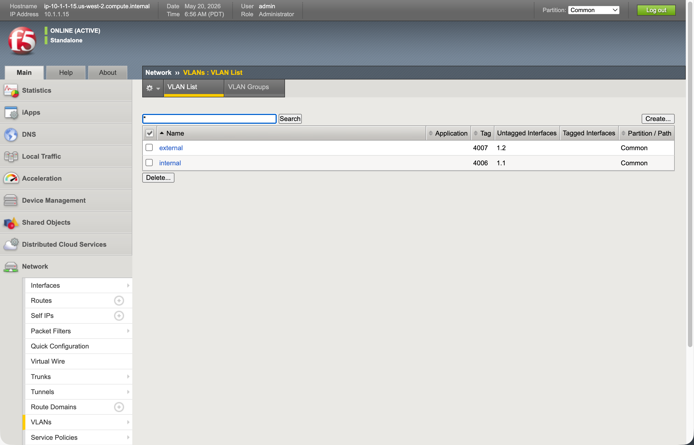

### 2.2 Configure Self IPs

A Self IP is an address on the BIG-IP that belongs to a specific VLAN and is used by the BIG-IP itself to source traffic and respond to ARP requests. Every VLAN that participates in client or server traffic needs at least one Self IP. Because this lab has two participating VLANs, internal (facing the MinIO AIStor cluster) and external (facing S3 clients), it needs two Self IPs, one per VLAN.
Continue by adding Self IPs that anchor the BIG-IP to each VLAN. In the BIG-IP Configuration utility, go to **Network > Self IPs** and click **Create**.

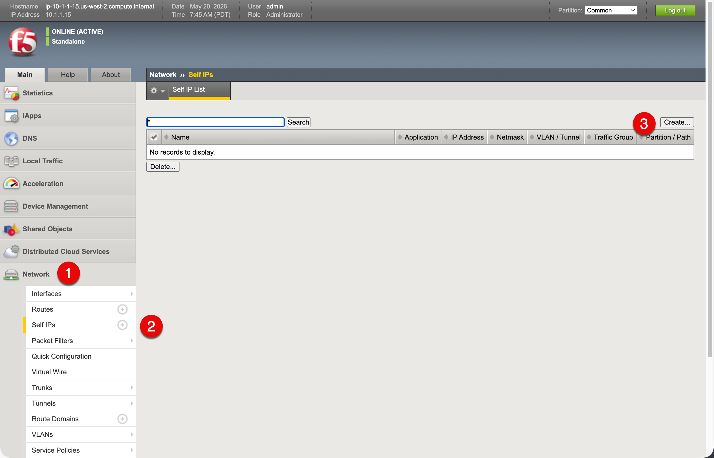

First, create a Self IP for the internal network using the following values:

- **Name:** `internal`
- **IP Address:** 10.1.10.151
- **Netmask:** 255.255.255.0
- **VLAN:** internal (interface 1.1 in this lab)

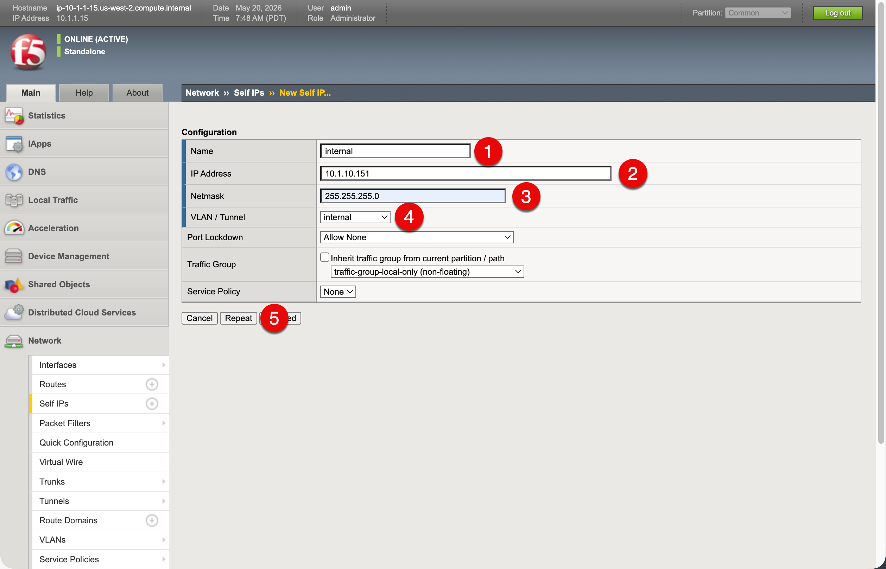

Click **Repeat** to save the internal Self IP and open a fresh form for the external one, then fill in the following values:

- **Name:** `external`
- **IP Address:** 10.1.40.151
- **Netmask:** 255.255.255.0
- **VLAN:** external (interface 1.2 in this lab)

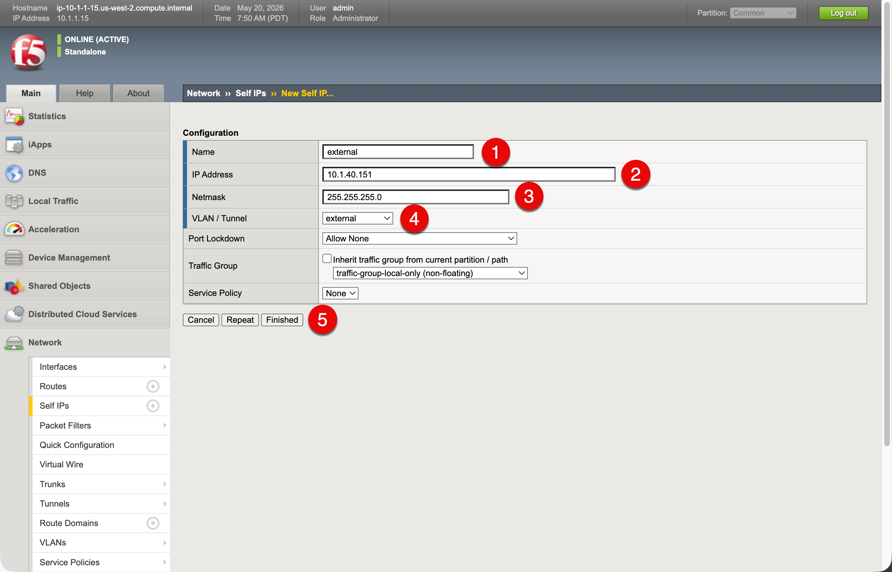

Click **Finished** to save. Both Self IPs now appear in the list.

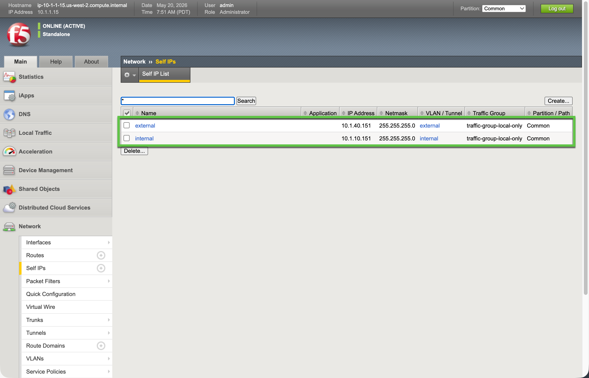

### 2.3 HTTP/HTTPS Custom Write Quorum Monitor

To make sure the cluster is writable, MinIO AIStor provides health check endpoints. To create a custom monitor in BIG-IP, go to **Local Traffic > Monitors** and click **Create**.
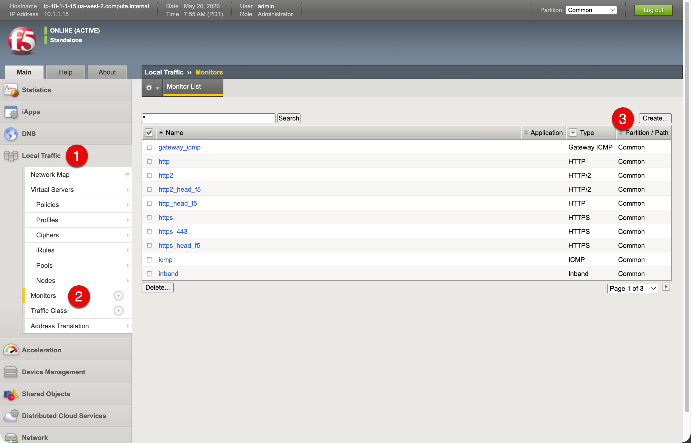

- **Type:** `HTTP` or `HTTPS`. Use `HTTPS` if the MinIO AIStor cluster is configured to accept encrypted connections.
- **Name:** `minio-health-check`
- **Send String:** `HEAD /minio/health/cluster HTTP/1.1\r\nHost:localhost\r\n\r\n`
- **Receive String:** `HTTP/1.1 200 OK`

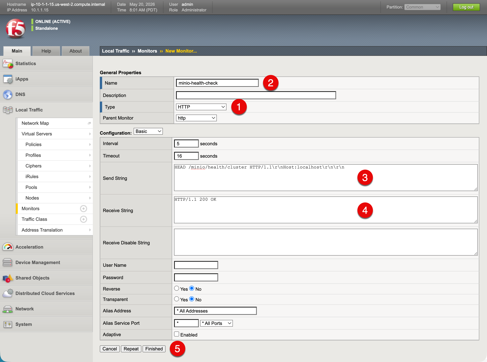

Click **Finished** to save the new custom monitor.

### 2.4 Pool

A pool is a logical group of backend servers, called pool members, that the BIG-IP load balances traffic across. The BIG-IP runs a health monitor against each member and only forwards traffic to members that pass the monitor. In this guide the pool members are the MinIO AIStor nodes, and the BIG-IP distributes incoming S3 requests across them.


In the picture above, the blue lines on either side of the BIG-IP represent the two segments of S3 traffic. The lines on the top are the traffic between the S3 client(s) and the BIG-IP, and the lines on the bottom are the traffic between the BIG-IP and the MinIO AIStor nodes. Each segment can be unencrypted or encrypted, and you can decide this for each one separately. Some organizations require storage traffic to be encrypted all the way from the S3 client to the S3 storage node, and some do not.

The **pool** configuration in this section controls the bottom segment, the traffic between the BIG-IP and the MinIO AIStor nodes. The top segment, between the S3 client and the BIG-IP, is controlled by the **virtual server** (see [2.6 Virtual Server](#26-virtual-server)). This guide provides steps for both unencrypted and encrypted options on each segment, so you can choose the combination that meets your organization's requirements.

#### 2.4.1 Pool for S3 traffic from BIG-IP to the MinIO AIStor cluster

Now, define the pool that represents the cluster. Navigate to **Local Traffic > Pools** and click **Create**.

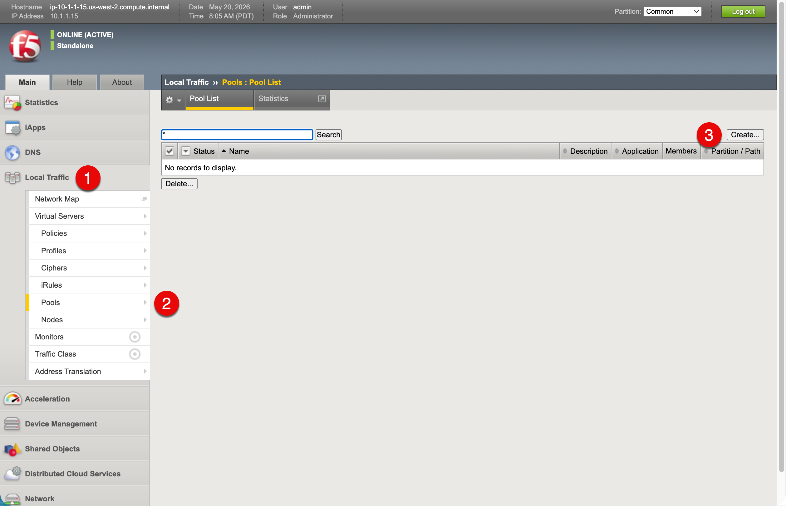

Fill in the pool-level details:

- **Name:** `minio-aistor-cluster`
- **Health Monitor:** `minio-health-check`
- **Load Balancing Method:** Least Connections (member)

The `minio-health-check` monitor created earlier sends requests to each node and uses MinIO AIStor's internal mechanism to determine cluster health and quorum readiness.

In the **New Members** section, add the first MinIO AIStor node:

- **Name:** `node-01`
- **Address:** 10.1.10.100
- **Service Port:** 9000 (the S3 data service port for the MinIO AIStor cluster in this lab. The protocol is HTTP or HTTPS depending on the cluster's TLS configuration.)

Click **Add** to save it to the member list, then enter the next node's details and click **Add** again until all nodes are added to the member list. In our example, we have four MinIO AIStor nodes and we must add all four nodes from the cluster range (10.1.10.100 - 10.1.10.103) before the pool is complete. Once every node appears in the member list, click **Finished**.

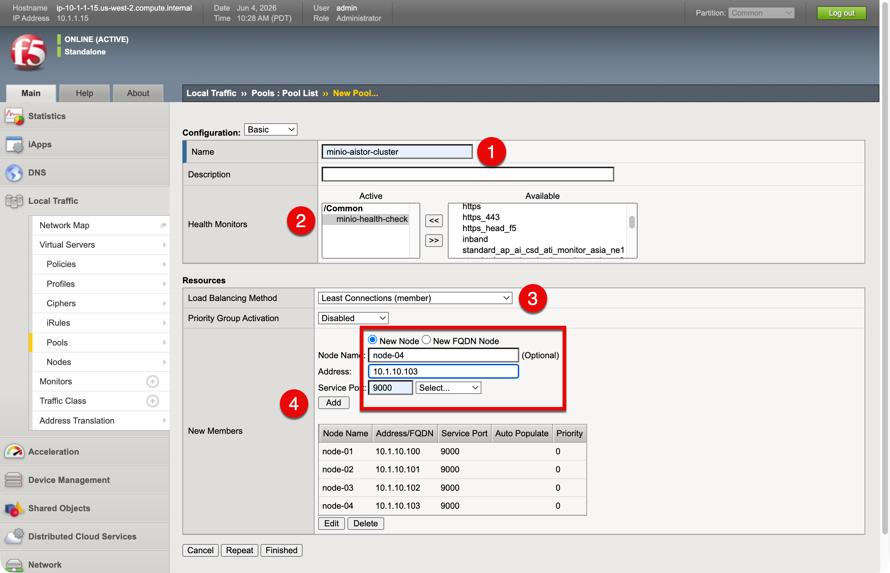

The new pool now appears in the Pools list.

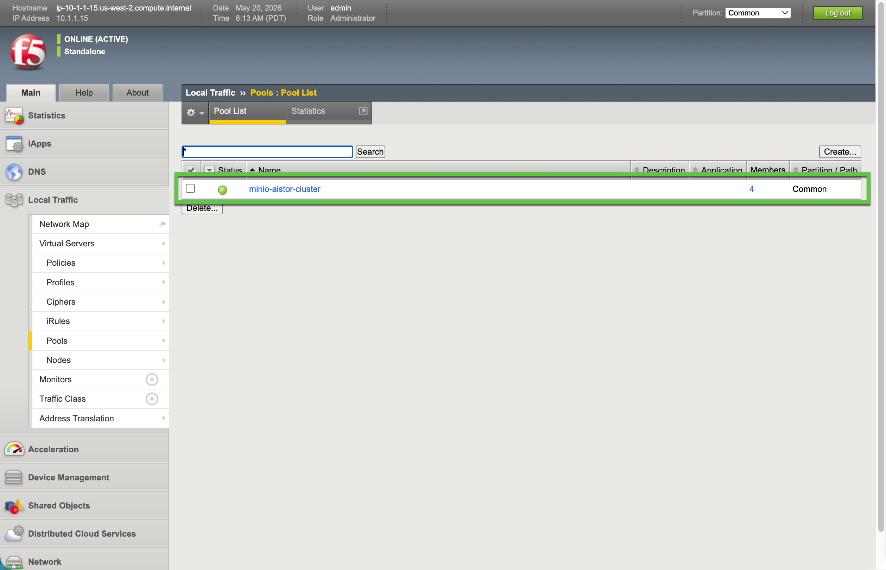

### 2.5 Optimization for S3 Traffic

Tuning the BIG-IP configuration for the specific characteristics of S3 traffic can improve performance and efficiency. This section outlines some of the key optimizations to consider for an S3 workload, including connection limits and TCP profile settings. These optimizations are optional but can help you get the most out of your BIG-IP deployment in front of a MinIO AIStor cluster.

#### 2.5.1 TCP Profiles

A TCP profile controls how the BIG-IP manages TCP connections, such as timers, buffer sizes, and congestion control. The BIG-IP ships with built-in profiles, but the default values are not ideal for MinIO AIStor S3 traffic. For better performance, F5 engineers recommend creating two custom profiles: one for the client side (between the S3 client and the BIG-IP) and one for the server side (between the BIG-IP and the MinIO AIStor nodes). Each side has different needs, so the settings are tuned separately.

The following sections walk through both profiles. Start by navigating to **Local Traffic > Profiles > Protocol > TCP** and clicking **Create**.

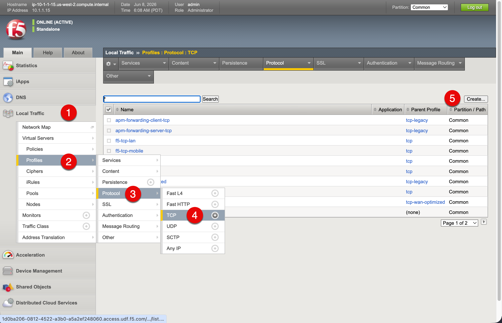

##### 2.5.1.1 Client TCP Profile

Set the name to `s3-tcp-custom-client` and set the parent profile as `s3-tcp`. This creates a new TCP profile that inherits all the settings from the `s3-tcp` profile, which is optimized for S3 workloads, and allows you to customize it.

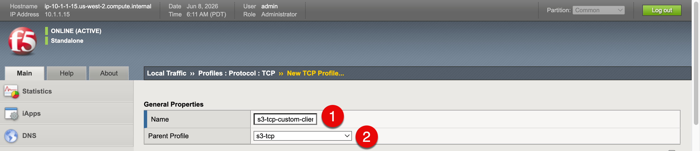

In the **Timer Manager** section, set the **Minimum RTO** to `200` milliseconds. This reduces the minimum retransmission timeout, which can improve performance for S3 workloads that are sensitive to latency.

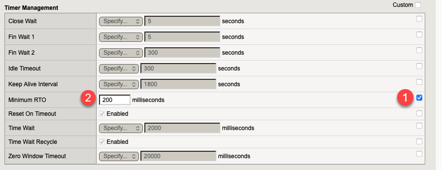

In the **Data Transfer** section, set the **Nagle's Algorithm** to **Auto**. This allows the BIG-IP to decide when to enable or disable Nagle's algorithm based on the traffic patterns, which can help optimize throughput for S3 workloads.


In the **Congestion Control** section, set the **Congestion Control** to **CUBIC**. CUBIC is a modern congestion control algorithm that can improve performance in high-bandwidth, high-latency networks, which can be beneficial for S3 traffic.


Click **Finished** to save the client TCP profile.

##### 2.5.1.2 Server TCP Profile

Create another TCP profile for the server side with the name `s3-tcp-custom-server` and the parent profile as `f5-tcp-lan`.

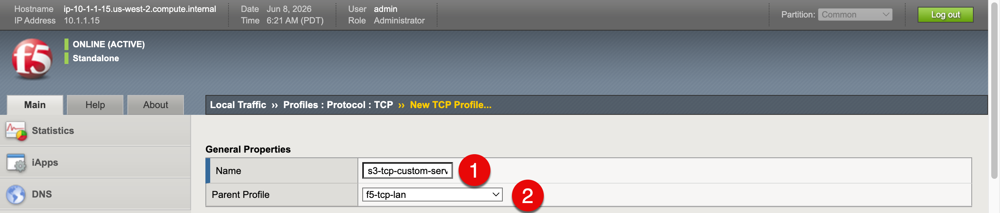

In the **Memory Management** section, set the following values:

- **Auto Receive Window** to **Enabled**
- **Auto Send Buffer** to **Enabled**
- **Proxy Buffer High** to `5200000` bytes
- **Proxy Buffer Low** to `5100000` bytes


In the **Loss Detection and Recovery** section, set the **Tail Loss** to **Disabled**.


Click **Finished** to save the server TCP profile.

#### 2.5.2 SSL Profiles

In this section we create SSL profiles for the client and server sides. The client SSL profile configures how the BIG-IP terminates TLS connections from S3 clients, while the server SSL profile configures how the BIG-IP initiates TLS connections to the MinIO AIStor nodes if your cluster serves encrypted S3 traffic. If your cluster serves unencrypted traffic, you can skip the server SSL profile and set the pool members' service port to 9000.

> **Note:** The following SSL profile configurations assume that the MinIO AIStor nodes use self-signed certificates or certificates that are not trusted by the BIG-IP. Don't use these settings in a production environment without understanding the security implications. In a production environment, you should use certificates from a trusted CA and configure the server SSL profile to validate them properly.

##### 2.5.2.1 Client SSL Profile

Go to **Local Traffic > Profiles > SSL > Client** and click **Create**.

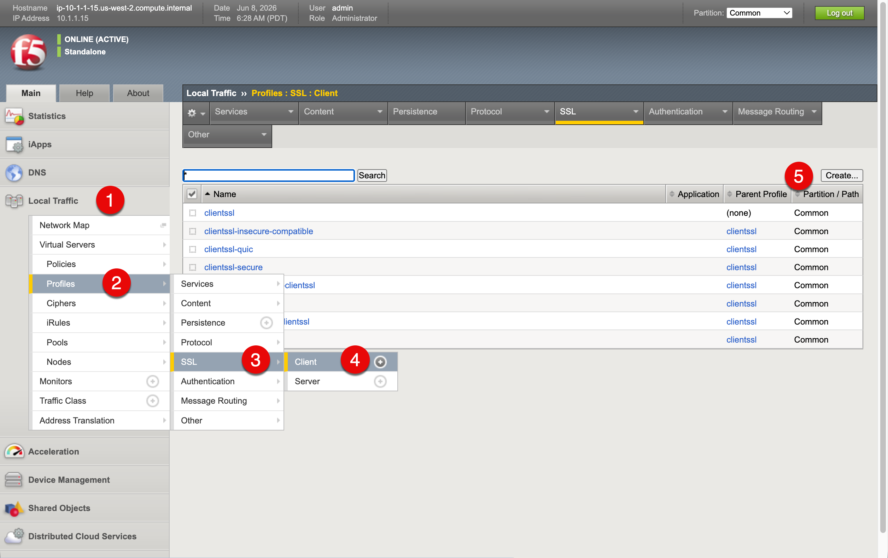

Set the name to `clientssl-minio-profile` and the parent profile to `clientssl`. In the **Configuration** section, set the **Certificate Key Chain** to the certificate and private key that the BIG-IP will use to terminate TLS connections from S3 clients. This should be a certificate that is trusted by your S3 clients, which may require using a certificate from a public CA or adding your own CA to the clients' trust stores if you use a self-signed certificate.

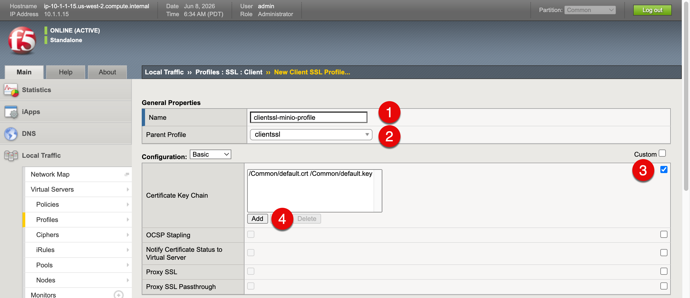

##### 2.5.2.2 Server SSL Profile

Go to **Local Traffic > Profiles > SSL > Server** and click **Create**.

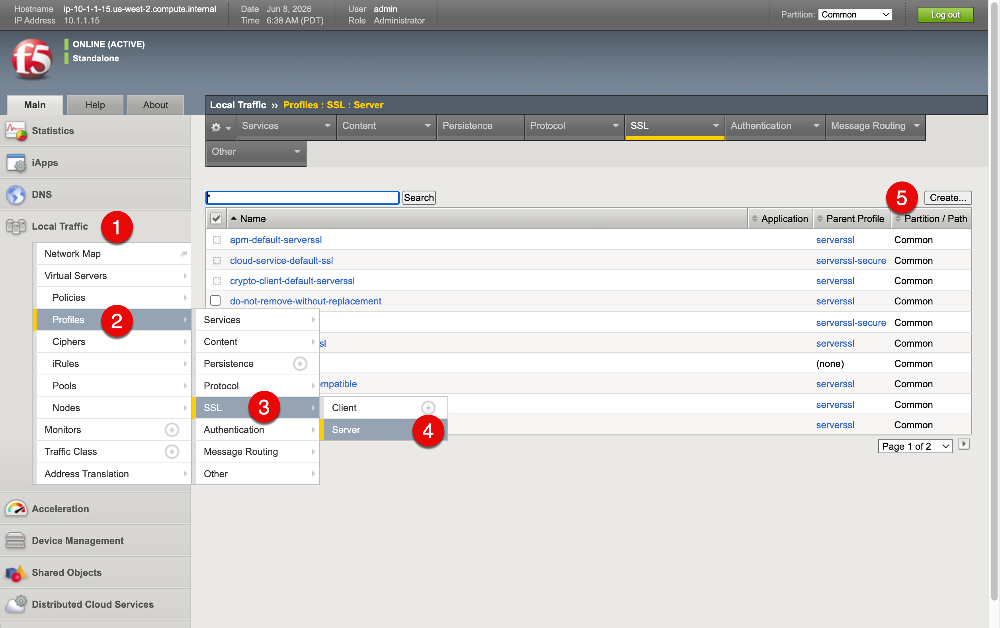

Set the name to `serverssl-minio-profile` and the parent profile to `serverssl`. In the **Server Authentication** section, set the **Server Certificate** to **Ignore**. This tells the BIG-IP not to validate the certificate presented by the MinIO AIStor nodes, which is necessary if the nodes use self-signed certificates or certificates that are not trusted by the BIG-IP.

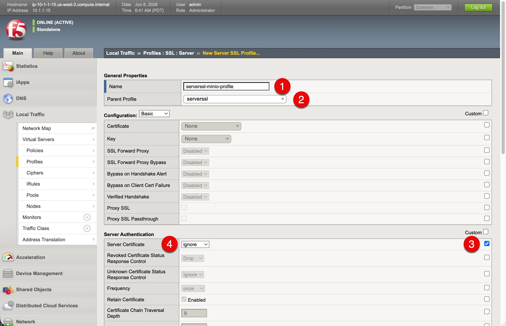

### 2.6 Virtual Server

A virtual server is the listener that clients connect to. It binds an IP address and port on the BIG-IP to a pool, applies any configured profiles and policies, and forwards traffic to a healthy pool member according to the load balancing method. For this S3 deployment, the virtual server is the single endpoint that S3 clients target instead of talking to individual MinIO AIStor nodes.

As shown in the setup diagram in the [Pool section](#24-pool), the virtual server controls the top segment of traffic, between the S3 client(s) and the BIG-IP. Like the pool, the virtual server can be configured for unencrypted (HTTP) or encrypted (HTTPS) traffic, and this guide provides the steps for both. The two segments are independent: you can, for example, terminate TLS from clients at the BIG-IP while sending either encrypted or unencrypted traffic onward to the MinIO AIStor cluster.

#### 2.6.1 Virtual Server for S3 Client Traffic to BIG-IP

With the pool in place, create the virtual server that exposes it. Navigate to **Local Traffic > Virtual Servers** and click **Create**.

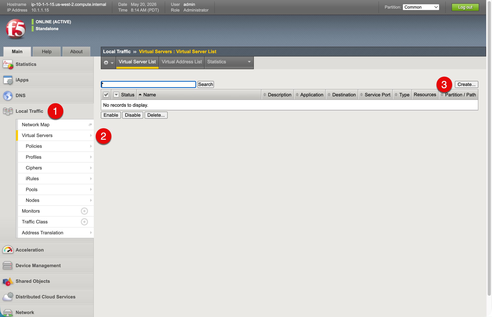

Fill in the basic details:

- **Name:** `minio-aistor-cluster-vs`
- **Source Address:** `0.0.0.0/0`
- **Destination Address/Mask:** 10.1.40.160 - Virtual IP (VIP) that S3 clients connect to
- **Service Port:** 443 (or 9000 for unencrypted traffic)

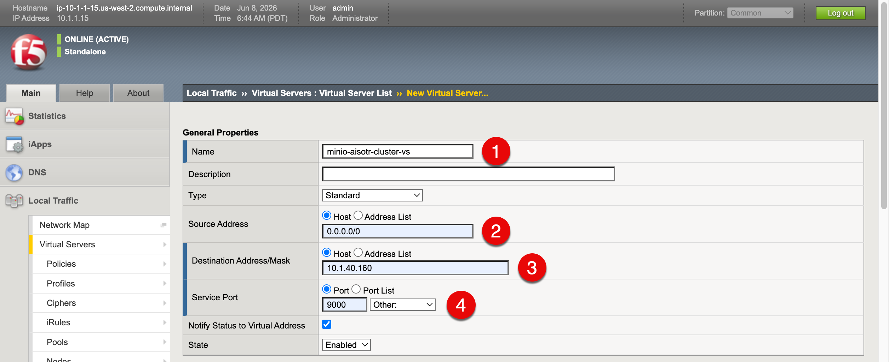

Next configure the Virtual Server Details:

- **1. Protocol**: Set to **TCP**
- **2. Protocol Profile (Client)**: Set to the custom client TCP profile you created earlier (`s3-tcp-custom-client`)
- **3. Protocol Profile (Server)**: Set to the custom server TCP profile you created earlier (`s3-tcp-custom-server`)
- **4. HTTP Client Profile**: Set to **HTTP**
- **5. SSL Profile (Client)**: Set to the client SSL profile you created earlier (`clientssl-minio-profile`). Skip this if you want to use unencrypted HTTP between S3 clients and the BIG-IP.
- **6. SSL Profile (Server)**: Set to the server SSL profile you created earlier (`serverssl-minio-profile`) if your MinIO AIStor cluster serves encrypted S3 traffic. If your cluster serves unencrypted traffic, set this to **None** and make sure the pool members' service port is set to 9000.
- **7. Source Address Translation:** Set to **Auto Map** to allow the BIG-IP to manage source address translation for return traffic.

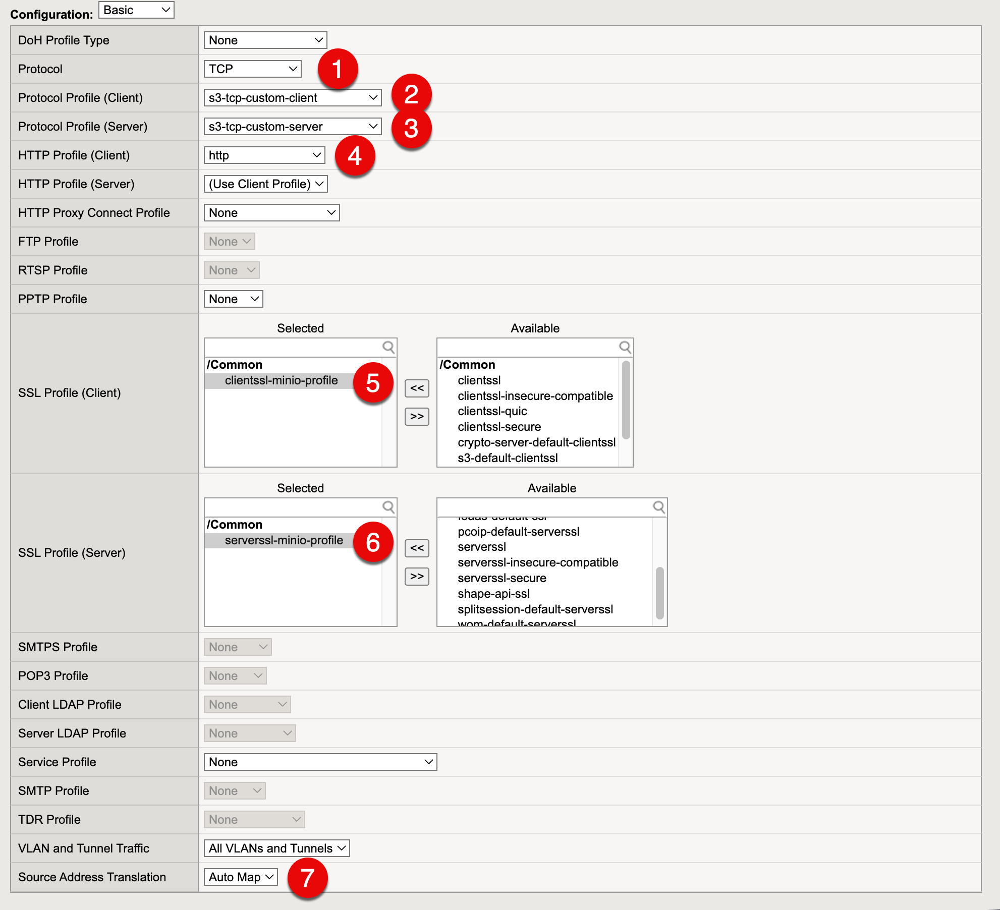

In the **Resources** section, select the `minio-aistor-cluster` pool from the **Default Pool** dropdown to bind the virtual server to the backend nodes.

Click **Finished** to save the virtual server.
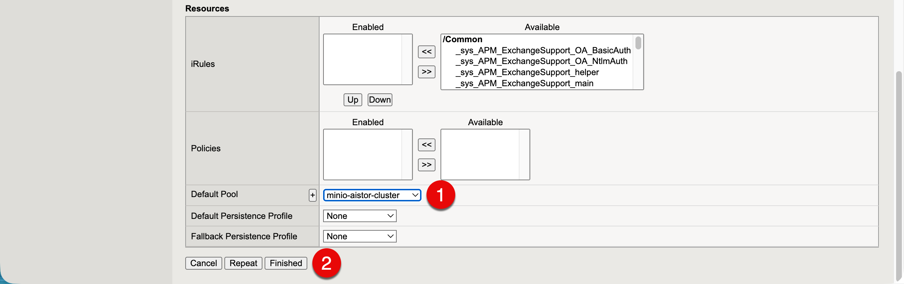

The virtual server now appears in the list. A green circle next to its name indicates that the virtual server is up and at least one pool member is passing health checks.

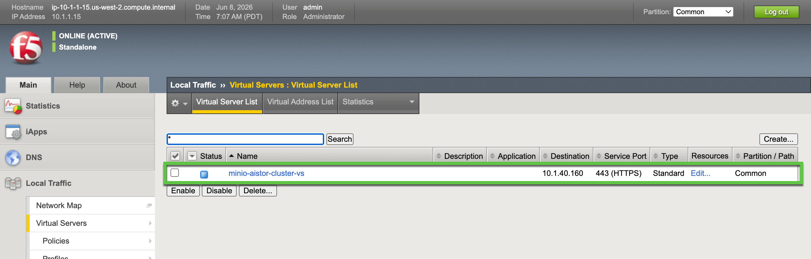

### 2.7 Test Virtual Server

With the virtual server up and at least one healthy pool member, validate that S3 traffic flows end to end through the BIG-IP.

#### 2.7.1 Configure MinIO AIStor Cluster

Before any traffic can be tested, the MinIO AIStor cluster needs an S3 bucket, a user, and a secret key.

Log in to the MinIO AIStor console:
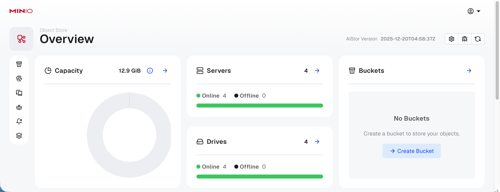

First, create a bucket and then a test user. The user will be restricted to the bucket you created.

##### 2.7.1.1 Create Bucket

In the left toolbar, click **Buckets**:
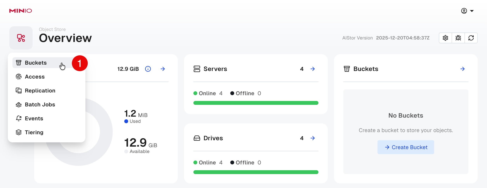

In the window that appears, click **+Add Bucket**.


Enter **warp-connectivity-test** as the bucket name and click **Create Bucket**.
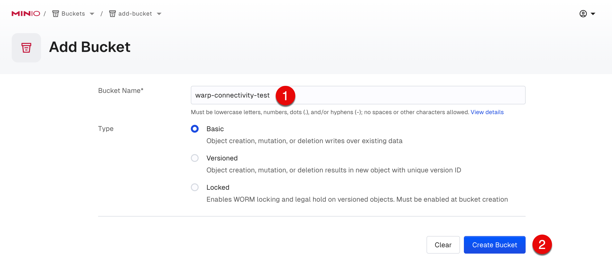

The new bucket appears in the list:
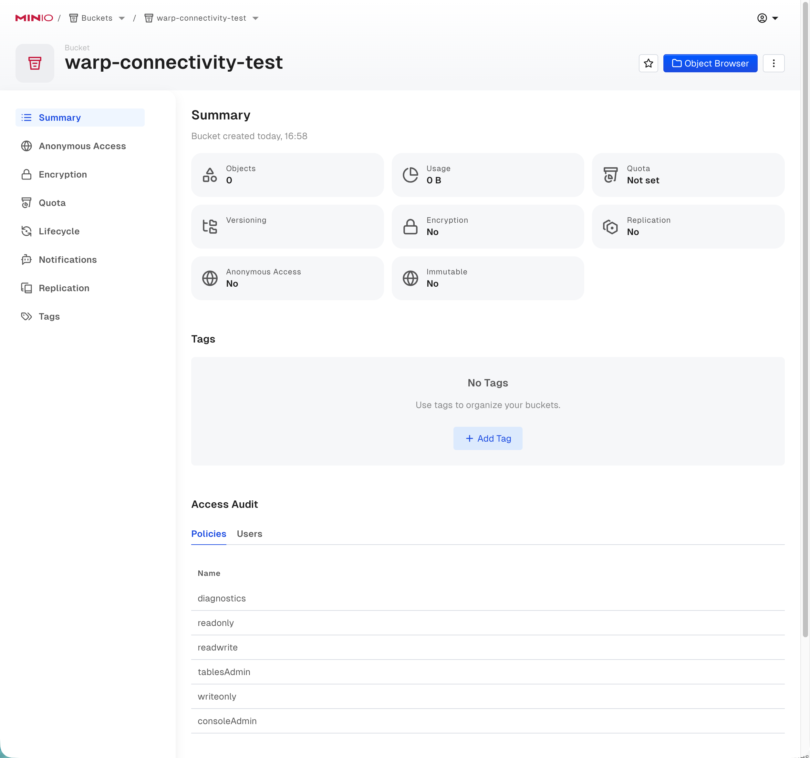

##### 2.7.1.2 Set Up User

Return to the MinIO AIStor welcome screen and click **Access**.
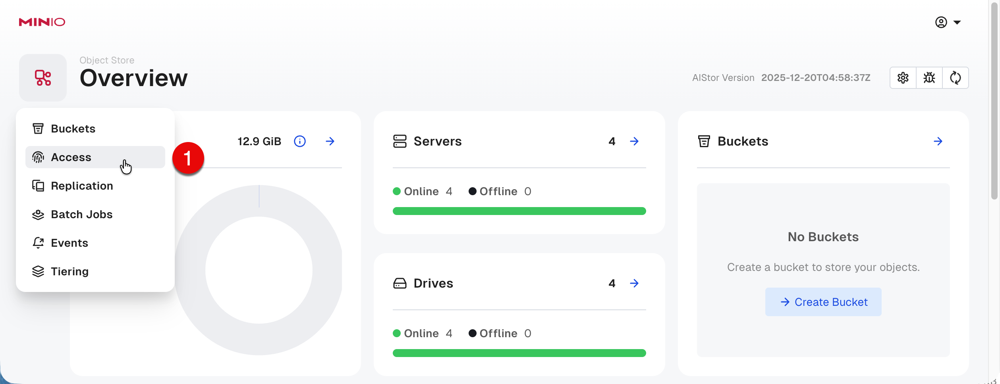

On the screen that appears, click **+Add User**.
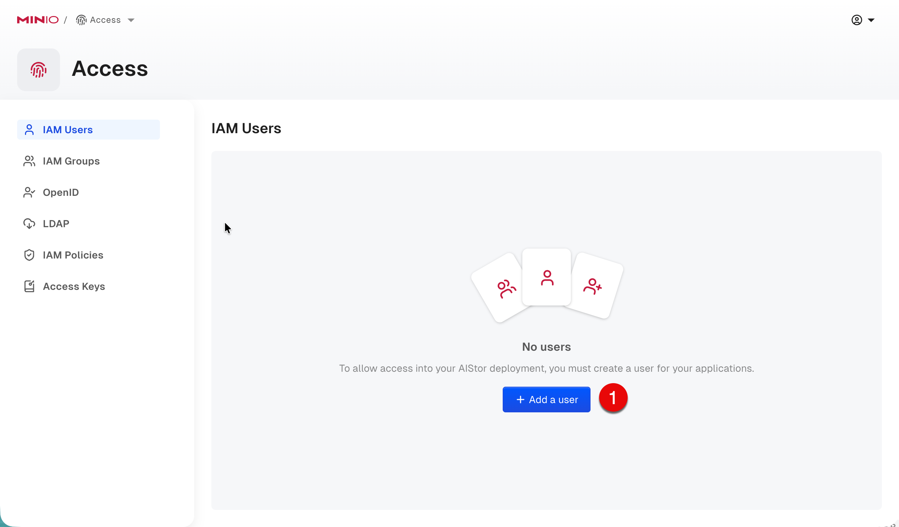

In the user details, enter the username and password. For policies, select **readwrite** because the user will send data to the MinIO AIStor bucket. No other policies are required. Then click **Save**.

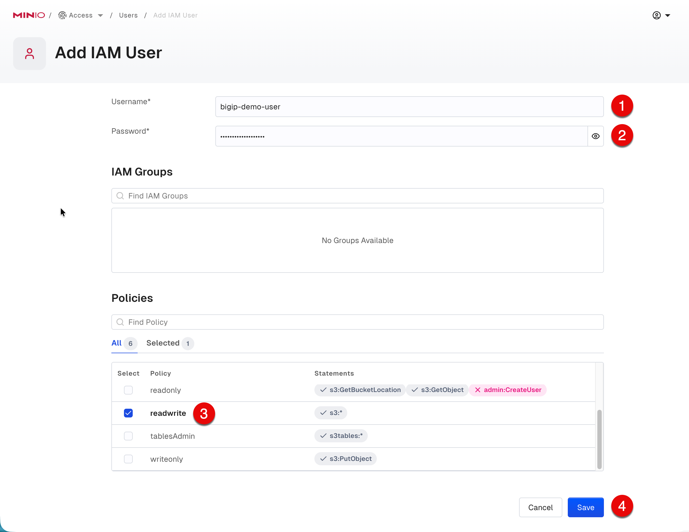

- **Username:** `bigip-demo-user`
- **Password:** `bigip-demo-password`
- **Policies:** `readwrite`

After the user is created, assign an access key that the MinIO Warp client can use for S3 authentication:
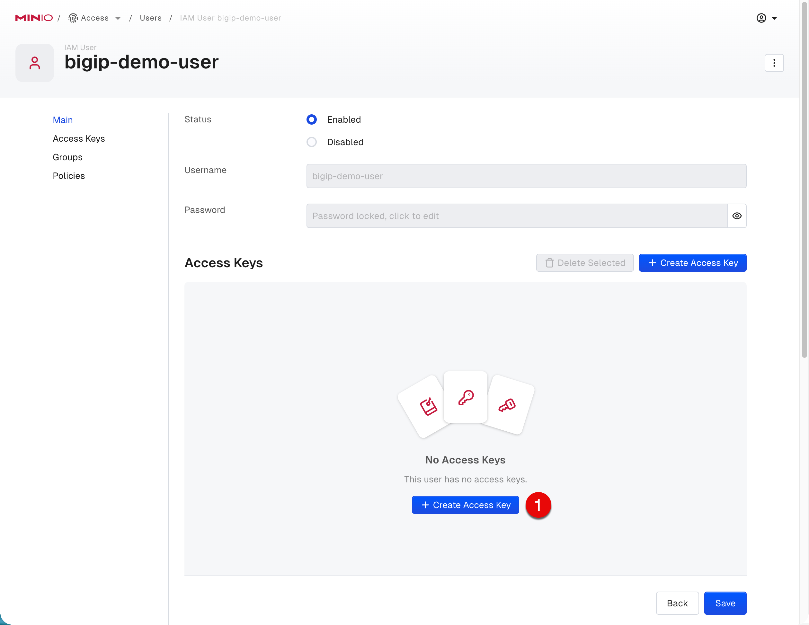
Click **Create Access Key**.

The **Add Access Key** dialog generates an **Access Key** and **Secret Key** for the selected user. Save both values now because they are required later when MinIO Warp connects to the MinIO AIStor cluster through the BIG-IP virtual server. Set **Expires** to tomorrow and enter the access key name:

- **Name:** `bigip-demo-user-access-key`

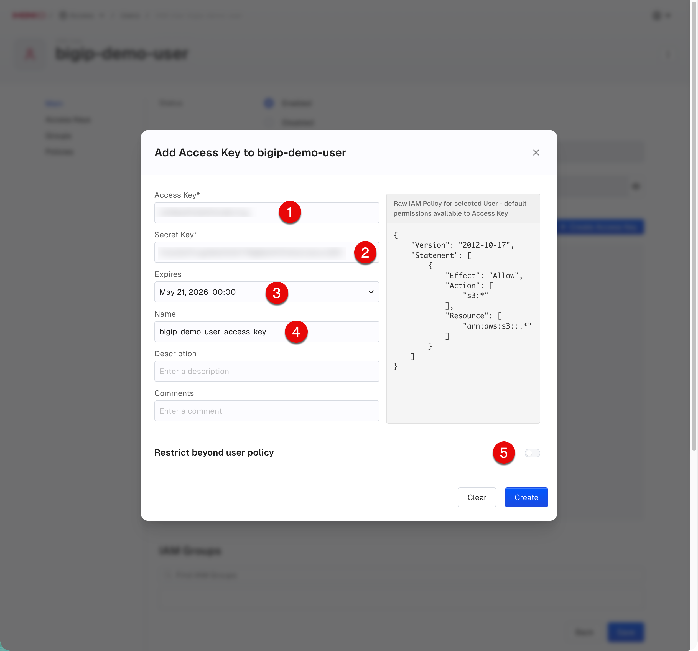

The access key inherits the `readwrite` policy from `bigip-demo-user`. To limit this key to the test bucket only, toggle on **Restrict beyond user policy**. This creates an additional IAM policy for the access key that can only reduce the parent user's permissions, not grant permissions beyond them.

After the restriction section opens, stay on the **Helper** tab. Leave the allowed action set to `s3:*`, then click **+ Add Resource Restriction** to replace the default all-buckets resource with the specific bucket used in this test.

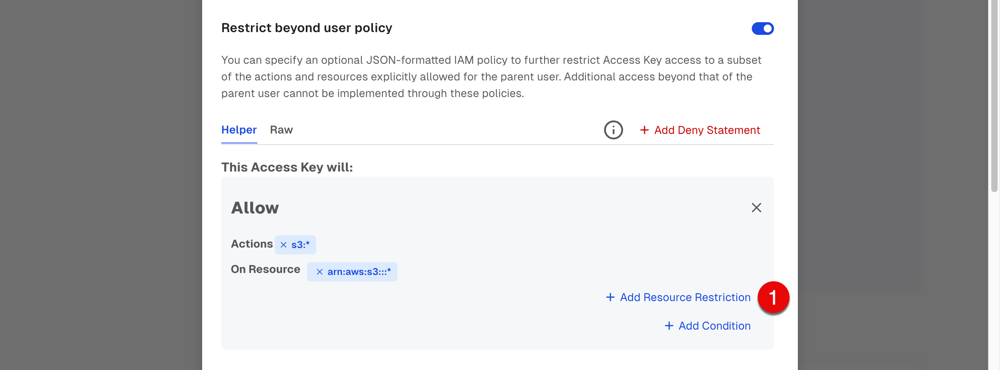

In the resource restriction editor, keep **Resource Type** set to **Resource**. Enter the bucket-level ARN `arn:aws:s3:::warp-connectivity-test`, then click **+** to add it to the policy. This ARN covers bucket-level operations, such as listing or checking the bucket.

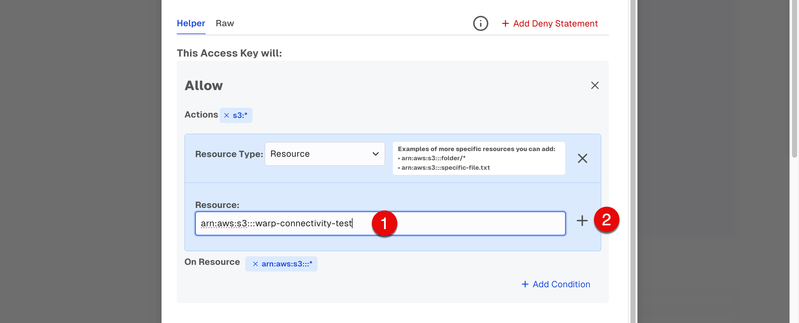

Repeat the resource restriction step for the object-level ARN `arn:aws:s3:::warp-connectivity-test/*`. This second ARN covers objects inside the bucket, such as the files MinIO Warp writes, reads, and deletes during the test. Confirm that both ARNs appear in the **On Resource** list, then click **Create**.

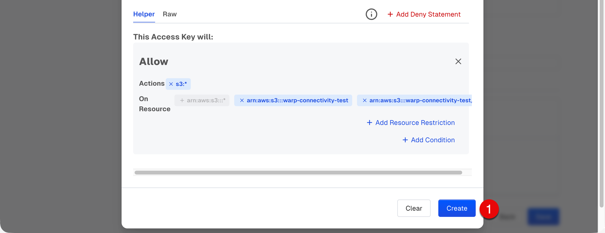

After the key is created, the MinIO AIStor console returns to the `bigip-demo-user` details page. In the **Access Keys** table, verify that the new key is listed with the configured name, expiry, and **Enabled** status.

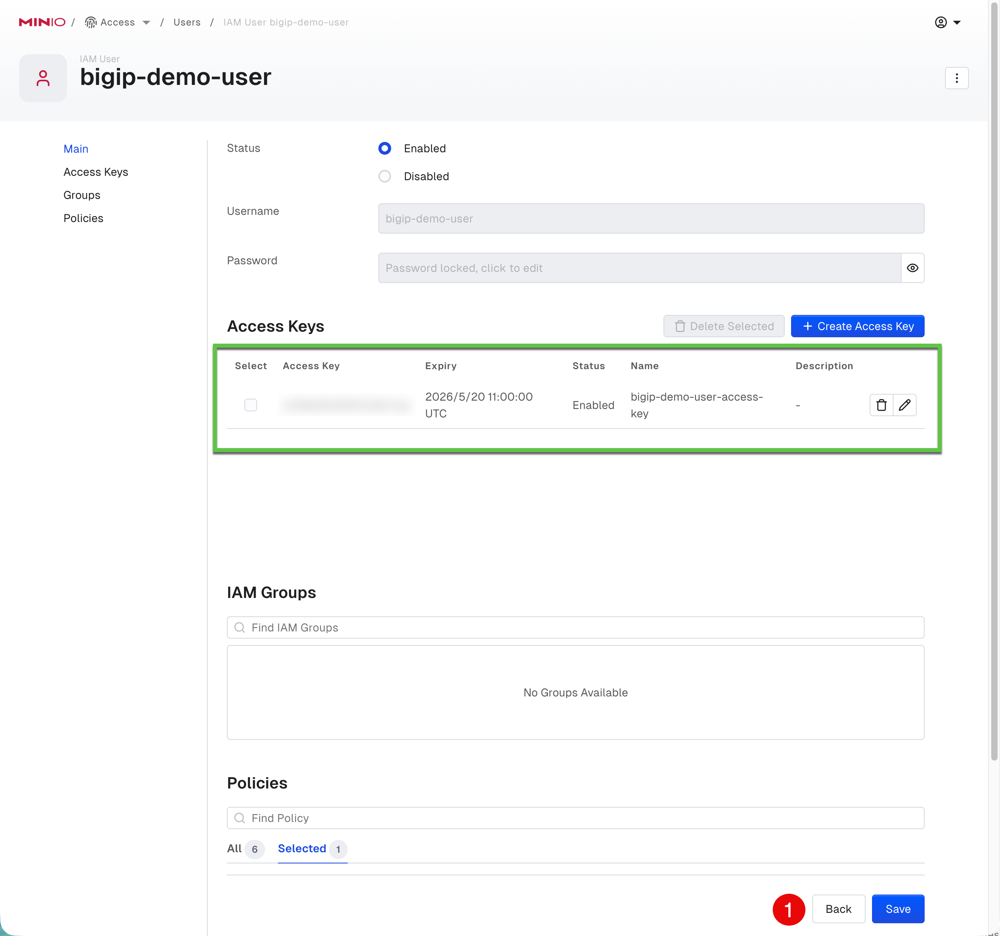

Return to the **IAM Users** list and verify that `bigip-demo-user` is still enabled and has the `readwrite` policy assigned. This confirms that the parent user policy is still in place while the access key has its own narrower bucket restriction.

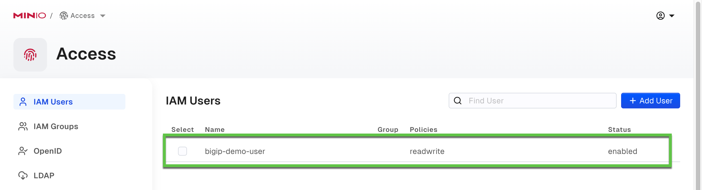

#### 2.7.2 Use MinIO Warp to Test Connectivity to the MinIO AIStor S3 Cluster Through the BIG-IP Virtual Server

MinIO Warp is MinIO's S3 benchmarking tool. It drives a representative S3 workload (mixed PUT, GET, DELETE, and STAT operations) against an endpoint and reports throughput, latency, and error counts. Pointing MinIO Warp at the BIG-IP virtual server address, rather than at an individual MinIO AIStor node, confirms that traffic flows end to end through the load balancer and gives a baseline measurement of the cluster's performance behind the BIG-IP.

Download and install the MinIO Warp CLI from the official MinIO download page:

[https://www.min.io/download/minio-warp](https://www.min.io/download/minio-warp)

Configure MinIO Warp with the BIG-IP virtual server address as the S3 endpoint, along with the access key (username) and secret key generated on the MinIO AIStor cluster, and run a short mixed-workload test:

```bash
export WARP_HOST=10.1.40.160:443        # the BIG-IP virtual server address and port
export WARP_ACCESS_KEY=your-user-name   # the access key saved earlier
export WARP_SECRET_KEY=your-secret-key  # the secret key saved earlier

warp mixed \
  --host "$WARP_HOST" \
  --access-key "$WARP_ACCESS_KEY" \
  --secret-key "$WARP_SECRET_KEY" \
  --bucket warp-connectivity-test \
  --objects 10 \
  --obj.size 1KiB \
  --concurrent 1 \
  --duration 2s \
  --tls \
  --insecure \
  --json > test_result.json
```

When the run finishes, use `jq` to summarize the totals from the JSON report. Inspect the full output with `cat test_result.json` if you need a detailed breakdown.

```bash
jq -r '
  .total |
  "Requests: \(.total_requests) | Objects: \(.total_objects) | Bytes: \(.total_bytes) | Errors: \(.total_errors)"
' test_result.json


Requests: 36 | Objects: 36 | Bytes: 24576 | Errors: 0
```

An error count of zero confirms that every request reached the MinIO AIStor cluster and returned a successful response through the virtual server.

### 2.8 Automation with Ansible

The manual steps above can be reproduced declaratively with Ansible. The playbooks, roles, and inventory live in [automation/](./automation/). See [automation/README.md](./automation/README.md) for installation, credentials, and usage.
